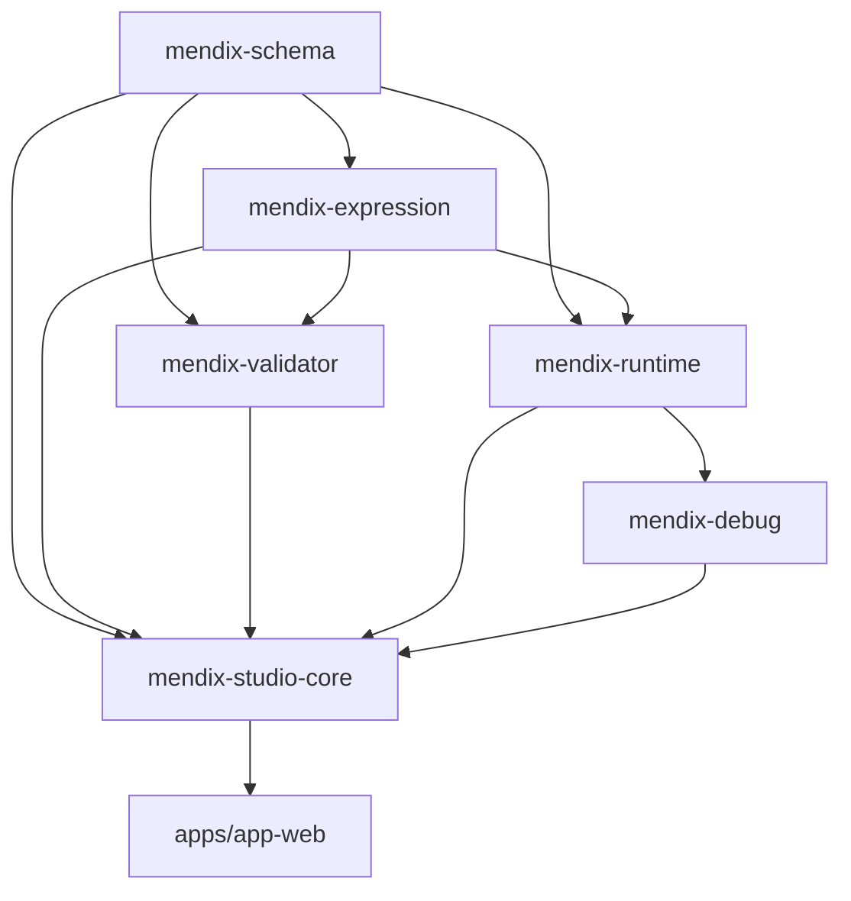
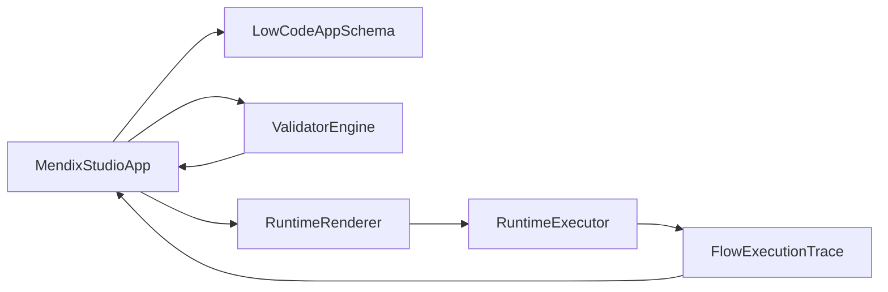

# Mendix Lowcode MVP Architecture

## 包分层

## 数据流

## 关键设计

- 统一协议：编辑态、校验态、运行态共用 `@atlas/mendix-schema`
- 可扩展 union：Widget/MicroflowNode/WorkflowNode 均为 discriminated union
- 运行时闭环：UI 触发 Action → Executor 执行 → UI Command 回写 → Trace 面板可视化
- 并行演进：`@atlas/microflow` 保持原包名，物理迁移后由 `mendix-studio-core` 复用
