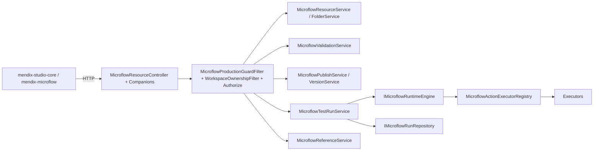

# Microflow 生产化重构差距报告（P0-1）

本报告基于 2026-04-29 仓库实际代码盘点，按主代理 `mendix_microflow_9818f883.plan.md` 的差距报告章节落盘。所有证据来自仓库源码与脚本，禁止使用任何外部假设。

## 0. 调用链概览



## 1. 当前差距清单（与计划章节一一对应）

### 1.1 前端资源树/sample 污染（P0-2）

| 位置 | 证据 | 影响 |
|---|---|---|
| `src/frontend/packages/mendix/mendix-studio-core/src/store.ts:388,446` | `appSchema: SAMPLE_PROCUREMENT_APP` / `JSON.parse(SAMPLE_PROCUREMENT_APP)` | 默认 `appSchema` 为静态 sample，加载真实 app 前会被错误展示 |
| `src/frontend/packages/mendix/mendix-studio-core/src/components/app-explorer/AppExplorerContainer.tsx:232` | `fallbackModuleId ?? "mod_procurement"` | 后端无模块时 fallback 假模块 |
| 同上 `AppExplorerContainer.tsx:579-582` | `[{ moduleId: fallbackModuleId, name: "Procurement" }]` | 同上 |
| `src/frontend/packages/mendix/mendix-studio-core/src/index.tsx:416` | `onClick={() => onOpen("app_procurement")}` | 索引页硬编码 sample appId |
| `src/frontend/packages/mendix/mendix-studio-core/src/index.tsx:464` | `export { SAMPLE_PROCUREMENT_APP }` | 生产 bundle 仍包含 sample，未隔离 |

### 1.2 微流列表与 CRUD（P0-7 / P1-x）

| 项 | 证据 | 状态 |
|---|---|---|
| list/create/rename/duplicate/delete/save | `src/frontend/packages/mendix/mendix-studio-core/src/microflow/adapter/http/http-resource-adapter.ts` | 已就绪 |
| Tree 右键 permissions 驱动 | `AppExplorerTree.tsx:142` `readonly` 不依据 `permissions/status/referenceCount` | 缺失（P1-x） |
| unpublish / callees / callers / move | 后端无对应 controller action | 缺失（P0-7） |

### 1.3 画布 Schema 保存与恢复

- 通路：`editor-save-bridge.ts.saveMicroflow` → `PUT /api/v1/microflows/{id}/schema`，正常保存恢复路径已通。
- 选择模型仍为单对象/单边（`schema.editor.selection`）；多选/批量复制粘贴/Undo 限制（P1-3）。
- Workbench「运行」与「调试运行」均调用 `runTest`（`microflow-workbench-toolbar.tsx:115-134`），缺差异语义。

### 1.4 节点工具箱 / runtime 支持

| 节点 | 前端 engineSupport | 后端 Executor | 状态 |
|---|---|---|---|
| Start / End / Parameter / Merge / Decision | supported | engine 内联 | OK |
| Object 系列（Create/Change/Commit/Delete/Retrieve） | supported | 真实 Executor | OK |
| Rollback / Cast / ListOperation | partial | `ConfiguredMicroflowActionExecutor` stub Success | **危险**（P1-2） |
| WebServiceCall / ExternalAction / 各 Connector 类 | partial | descriptor 指向不存在的 `WebServiceCallActionExecutor.cs` 等类型名，运行时由 Configured connector 分支 → `RUNTIME_CONNECTOR_REQUIRED` | 描述符类型名漂移（P1-2） |
| `loopedActivity` / `errorEvent` / `annotation` 节点 | 已建模 | `MicroflowRuntimeEngine.ExecuteNodeAsync` switch **缺失** → `_ => Unsupported` | **P0-4** |
| Parallel/Inclusive Gateway | 显式 unsupported | engine 显式失败 | OK，留 P2 真实化 |
| `showPage` / `closePage` 等 RuntimeCommand | partial | Executor 返回 `PendingClientCommand`，引擎当作 success → `ContinueAfterAction` | **P0-4 修复** |

### 1.5 mock runner 双轨

- 仓库不存在 `MicroflowMockRuntimeRunner.cs`/`IMicroflowMockRuntimeRunner` 实体（grep 0 命中）。`MicroflowTestRunService` 注入 `IMicroflowRuntimeEngine`。
- 但 **CallMicroflow 双路径**：`MicroflowRuntimeEngine.ExecuteCallMicroflowAsync` 直接 `RunInternalAsync` 与 `CallMicroflowActionExecutor` 并存（P0-5）。
- 前端 `mock-test-runner.ts` / `local-adapter.ts` 仅在非 `http` adapter mode 使用；生产 bundle 已禁用（参见 `microflow-adapter-config.ts`）。

### 1.6 Trace / Run / Cancel 权限漏洞（P0-3）

- `MicroflowTestRunService.GetRunTraceAsync(runId)`、`GetRunSessionAsync(runId)`、`CancelAsync(runId)` 仅按 runId 查询，未校验 session 的 `WorkspaceId/TenantId/ResourceId` 与当前请求上下文一致。
- 实体 `MicroflowRunSessionEntity`、`MicroflowRunTraceFrameEntity` 未持久化 `WorkspaceId/TenantId`（仅 ResourceId）。
- `CancelAsync` 仅改 DB 状态，未触发 `CancellationToken`，引擎不会真停（P0-6）。

### 1.7 验证脚本与文档漂移（P0-1 已修复）

| 项 | 漂移描述 | 修复 |
|---|---|---|
| `scripts/verify-microflow-production-readiness.ts` | health URL 使用 `/api/microflows/health` 等无 `v1` 前缀 | 本轮已改为 `/api/v1/...` |
| `docs/microflow-api-contract-current.md` | 文档说控制器 `[AllowAnonymous]` + 无 `v1` 路径 | 本轮已重写 |
| `docs/contracts.md:2378` | `POST /api/microflows/runtime/navigate` | 本轮已加 `/v1` |
| `docs/microflow-p1-release-gap.md` | 历史快照中残留 AllowAnonymous 描述 | 本轮已加 disclaimer 指向 current 文档 |

### 1.8 引擎超时 / 取消（P0-6）

- `RuntimeContext.TryStep` enforce `MaxSteps`（默认 1000，clamp 1-5000）；
- `Microflow:Runtime:RunTimeoutSeconds`（生产 300）在 `GetRuntimeHealth` 报告，但 `RunInternalAsync` 主循环未做超时包装；
- `CancelAsync(runId)` 写 DB 不联动正在执行的 engine。

### 1.9 引用保护与跨 workspace 引用（P0-8）

- `EnsureNoActiveTargetReferencesAsync` 已实现 active reference > 0 阻断删除。
- `MicroflowReferenceIndexer` 写引用时未校验 target 与 source 的 workspace/tenant 一致性。
- repository `GetByIdAsync` 仅按 `Id`，应用层缺统一 `EnsureScoped(resource, ctx)` 工具。

### 1.10 Audit（P0-9）

- `Atlas.Application.Microflows` / `Atlas.AppHost/Microflows` 下未发现 `IAuditWriter` 调用；仅有 entity 字段戳。
- `appsettings.Production.json` 已声明 `Microflow:Observability:AuditLogEnabled=true`，但代码未连线。

### 1.11 测试与 verify 脚本

- 后端 xUnit：`tests/Atlas.AppHost.Tests/Microflows/*` 覆盖 Engine/Registry/Transaction/Folder/Resource Create/Expression。Validation/Publish/Resource 全 CRUD/Reference/Trace 权限缺集成测试（P1-7）。
- Playwright：4 条 microflow spec；缺 canvas 拖拽连线、属性面板、validate 错误定位、publish 流、cancel run、impact 分析、IDOR 验证（P1-7）。
- 缺 `verify-microflow-runtime-coverage.ts` 双向矩阵（P0-10）。

## 2. P0/P1 修复与本报告的对应关系

| 阶段 | 计划 to-do | 本报告对应章节 |
|---|---|---|
| P0-1 | 落盘差距报告，修正过期文档/health URL | 1.1-1.11（本节）；本文件本身就是产出物 |
| P0-2 | 移除前端 sample fallback | §1.1 |
| P0-3 | RunSession/Trace ownership + 修复 IDOR | §1.6 |
| P0-4 | 引擎补缺节点 + ShouldEnterErrorHandler + PendingClientCommand | §1.4 |
| P0-5 | 统一 CallMicroflow | §1.5 |
| P0-6 | RunTimeoutSeconds enforce + cancel 联动 | §1.8 |
| P0-7 | 缺失 API + 错误码 | §1.2 / §1.4 |
| P0-8 | EnsureScoped + cross-workspace 引用拒写 | §1.9 |
| P0-9 | Audit 接入 | §1.10 |
| P0-10 | verify-microflow-runtime-coverage.ts 矩阵 + CI | §1.11 |
| P1-1..P1-7 | 属性面板、Executor、画布、引用、Validate gate、Store、E2E | 后续 PR |
| P2 | 并发网关、step debug、协同编辑等 | 后续 |

## 3. 验证

```bash
npx tsx scripts/verify-microflow-production-readiness.ts \
    MICROFLOW_READINESS_SKIP_BUILDS=1 \
    MICROFLOW_READINESS_SKIP_LIVE_HEALTH=1
```

P0-1 不引入代码逻辑变更，仅文档+脚本路径订正；构建保持 0 errors / 0 warnings。
