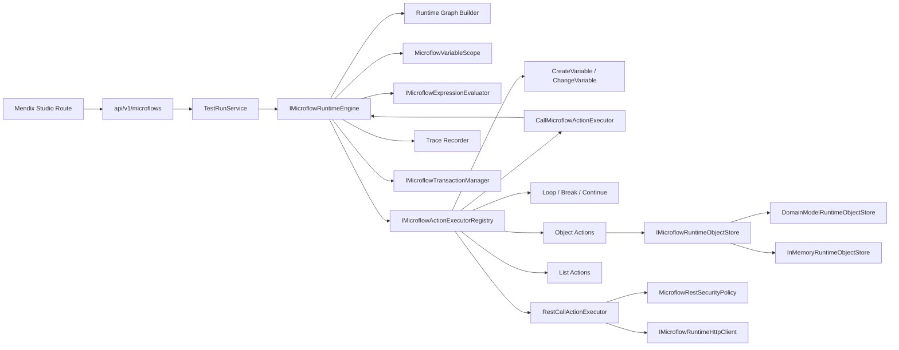

# Microflow Runtime Engine Architecture

本文定义 Microflow 发布版真实运行时架构。运行时必须服务于目标前端路由 `/space/:workspaceId/mendix-studio/:appId`，并通过 `api/v1/microflows` 系列 API 暴露能力。

## Architecture

## Execution Flow

1. API 层接收 `TestRunMicroflowApiRequest`，解析 workspace、tenant、user、traceId。
2. `MicroflowTestRunService` 加载 draft schema 或 published snapshot。
3. 运行前执行 design-time/runtime validation。
4. `IMicroflowRuntimeEngine.ExecuteAsync` 构建图：
   - `objectId -> object`
   - `originObjectId -> outgoing flows`
   - start 节点唯一
   - end 节点存在
   - flow target 全部存在
5. 引擎绑定输入参数到变量作用域。
6. 引擎从 Start 按 sequence flow 逐节点执行，不按数组顺序执行。
7. 控制流节点由引擎处理，action 节点交给 `IMicroflowActionExecutorRegistry`。
8. 每个节点进入/退出/错误/分支/调用/返回都记录 trace。
9. 成功时返回 output；失败时返回统一 runtime error；系统异常交给 API exception filter。

## Runtime Context

`MicroflowExecutionContext` 必须包含：

- `WorkspaceId`
- `TenantId`
- `MicroflowId`
- `SchemaId`
- `Version`
- `ExecutionMode`
- `CurrentUser`
- `InputParameters`
- `VariableScope`
- `ObjectStore`
- `CurrentNode`
- `CallStack`
- `TraceRecorder`
- `CancellationToken`
- `Options`
- `CorrelationId`
- `TraceId`

## Variable Scope

变量规则：

1. 参数进入初始作用域。
2. Create Variable 定义新变量。
3. Change Variable 修改已有变量。
4. 作用域按 frame / loop / action 分层。
5. 缺失变量返回 `VARIABLE_NOT_FOUND`。
6. 类型不匹配返回 `VARIABLE_TYPE_MISMATCH`。
7. End 节点从变量或表达式求值获得返回值。
8. Call Microflow return binding 写入调用方作用域。

## Type System

支持类型：

- `String`
- `Boolean`
- `Integer`
- `Decimal`
- `DateTime`
- `Object`
- `List`
- `Enumeration`
- `Void`
- `None`

类型校验发生在：

- 参数绑定
- 表达式求值
- End return
- Call Microflow parameter mapping
- Call Microflow return binding
- List element 操作
- Object store 操作

## Expression Sandbox

表达式统一通过 `IMicroflowExpressionEvaluator`。禁止：

- 任意 C# / JavaScript / SQL 执行
- 反射
- 文件访问
- 网络访问
- 动态编译

支持：

- string / number / boolean / null
- 变量引用
- 比较运算
- 布尔运算
- 算术运算
- 括号
- 字符串拼接
- 可选 if/then/else

## Object Store

发布目标包含两层对象存储：

| 实现 | 使用场景 | 要求 |
|---|---|---|
| `DomainModelRuntimeObjectStore` | PublishedRun / 允许写真实数据的 Debug | 对接 `IMicroflowEntityAccessService` 与租户隔离，事务失败回滚。 |
| `InMemoryRuntimeObjectStore` | TestRun / Debug dry-run / unit tests | 不写生产数据库，明确只在 test/debug 使用。 |

## Transaction

- 一个 microflow run 默认一个 transaction。
- Call Microflow 默认加入调用方 transaction。
- Schema 可指定 child transaction / no transaction。
- 失败时回滚未提交变更。
- `CommitObject` 可 flush，但最终一致性由 transaction 控制。
- REST call 不参与数据库事务；文档和 trace 必须说明外部副作用。
- Test-run 默认 dry-run，除非显式允许真实写入。

## Trace

Trace event 字段：

- `traceId`
- `runId`
- `microflowId`
- `nodeId`
- `nodeName`
- `nodeType`
- `eventType`
- `timestamp`
- `durationMs`
- `inputSnapshot`
- `outputSnapshot`
- `error`
- `callDepth`
- `parentFrameId`
- `callerObjectId`
- `callerActionId`

前端 trace panel 必须展示：

- success / failure
- output
- duration
- trace events
- call stack
- failed node
- error message
- traceId

## Resource Limits

默认限制：

| 限制 | 默认 | 错误码 |
|---|---:|---|
| Timeout | 30000 ms | `RUNTIME_TIMEOUT` |
| Max steps | 1000 | `RUNTIME_MAX_STEPS_EXCEEDED` |
| Max call depth | 20 | `CALL_DEPTH_EXCEEDED` |
| Max loop iterations | 1000 | `LOOP_LIMIT_EXCEEDED` |
| Max response bytes | 1 MB | `REST_RESPONSE_TOO_LARGE` |
| REST redirects | 0 by default | `EXTERNAL_CALL_BLOCKED` |

## Security

Runtime 必须确保：

1. workspace/tenant isolation。
2. permission check。
3. cancellationToken 可中止运行。
4. expression sandbox。
5. REST allowlist/denylist 与 SSRF 防护。
6. private network 默认阻断。
7. trace/input/output 脱敏。
8. sensitive headers 禁止写入 trace。
9. 递归调用按 maxCallDepth 阻断。
10. loop 按 maxLoopIterations 阻断。

## Module Boundaries

- Controller 只做 HTTP 编排，不直接操作数据库。
- Application.Microflows 持有 runtime engine、DTO、service、executor。
- Infrastructure 持有 SqlSugar repository。
- 前端只消费 API，不生成 run result。
