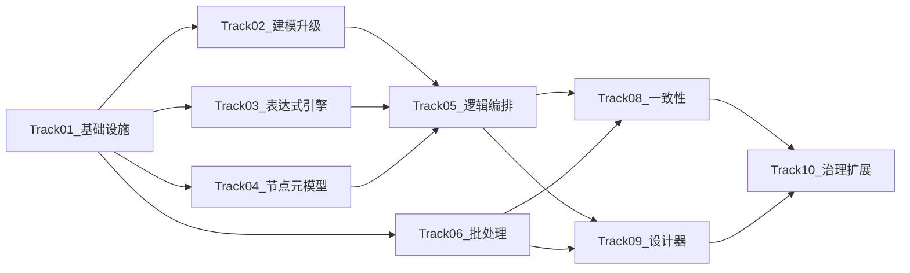

# 后台逻辑处理增强引擎 — 进度跟踪文档

> **文档目的**：将《后台逻辑处理增强引擎》架构设计（22 章）拆解为最小可闭环 case，按轨道（Track）跟踪前后端、契约与 `.http` 测试完整性。  
> **范围说明**：**Track-07（库存/单据/财务领域内核）不纳入本轮实施**（见下文轨道列表）。  
> **关联契约**：接口契约以 [contracts.md](./contracts.md) 为准；本表「contracts 同步」列指向需在该文档增补的章节。

## 全局进度统计

| 指标 | 数量 |
|------|------|
| 实施轨道（Track） | 9 |
| Case 总数 | **190**（= 附件清单基准 **182** 行 + **拆细补齐 8** 行，见 Track-02 末段） |
| 后端 Case（-B） | 151 |
| 前端 Case（-F） | 39 |
| 已实现 | 96 |
| 部分实现 | 79 |
| 未实现 | 15 |

**审计状态枚举（单一事实来源）**：`已实现` | `部分实现` | `未实现`

## 审计快照（2026-04-02）

> 本节作为本文件的审计基线；后续 Case 明细状态回填以此口径推进。  
> 判定口径：代码实现 + contracts 同步 + `.http` / 前端页面齐备。

| Track | 已实现 | 部分实现 | 未实现 | 备注 |
|------|------:|------:|------:|------|
| Track-01 | 7 | 0 | 0 | 项目骨架与 DI 完整 |
| Track-02 | 27 | 9 | 0 | 依赖图函数/流程、计算字段绑定仍有占位 |
| Track-03 | 17 | 7 | 0 | 窗口函数与 Monaco/引擎统一性需补齐 |
| Track-04 | 12 | 6 | 0 | 模板实体与前端收藏能力待补强 |
| Track-05 | 14 | 9 | 7 | 关键缺口在错误分支/补偿/子流程/循环/X6 |
| Track-06 | 10 | 12 | 0 | 执行闭环与调度接线不足 |
| Track-08 | 0 | 6 | 5 | 幂等分层与错误分类未闭环 |
| Track-09 | 5 | 17 | 4 | 设计器组件大量已建未挂载 |
| Track-10 | 6 | 10 | 0 | 治理已落地，插件/SDK 与可观测需深化 |

---

## 架构章节 → Track 映射

| 架构文档章节（概要） | Track | 说明 |
|---------------------|-------|------|
| §3 总体架构、§4 模块拆分 | Track-01 | 项目分层与 DI 骨架 |
| §5.1–§5.5 元数据与动态建模 | Track-02 | 发布快照、兼容性、DDL、依赖图 |
| §12 表达式与函数 | Track-03 | CEL 扩展、AST、类型、函数元数据 |
| §10–§11 节点体系与运行语义 | Track-04 | 节点元模型、端口、分类注册 |
| §4.3/§4.5/§8 编排与混合图 | Track-05 | 逻辑流、DAG、执行引擎 |
| §4.6/§14 批处理 | Track-06 | 分片、批次、checkpoint、死信 |
| §15 事务与一致性 | Track-08 | Inbox、幂等、错误分类、熔断限流 |
| §6–§9 设计器与信息架构 | Track-09 | 统一设计台、页面联动 |
| §16–§18 可观测、治理、扩展 | Track-10 | 日志指标、治理、SPI、SDK |
| §4.7–§4.9、§13 领域内核（库存/单据/财务） | **（本轮不实施）** | 已从进度表移除 |

---

## 轨道依赖关系（无环）

以下为有向无环图（DAG）；**不允许**出现轨道级循环依赖。

**验证结论（轨道级）**：从 `T01` 出发可拓扑排序为 `T01 → T02,T03,T04,T06 → T05 → T08,T09 → T10`，**不存在环路**。

---

## Case 编号规则

- 格式：`T{轨道号}-{序号}-{B|F}`  
- `B`：后端（实体/接口/实现/Controller/`.http`）  
- `F`：前端（页面/组件/路由/i18n）

---

## contracts.md 同步追踪（汇总）

| 主题 | contracts.md 目标章节（占位见该文档） | 关联 Case（示例） |
|------|----------------------------------------|-------------------|
| 发布快照 / 兼容性 / DDL / 迁移审计 | 「后台逻辑引擎 - 动态建模发布」 | T02-24~T02-26-B；拆细 T02-29~T02-36-B |
| 表达式与函数 API | 「后台逻辑引擎 - 表达式与函数」 | T03-22-B |
| 节点注册表 API | 「后台逻辑引擎 - 节点类型」 | T04-17-B |
| 逻辑流与执行 API | 「后台逻辑引擎 - 逻辑流与执行」 | T05-26~T05-27-B |
| 批处理与死信 API | 「后台逻辑引擎 - 批处理」 | T06-18~T06-19-B |
| 治理与扩展 API | 「后台逻辑引擎 - 治理与插件」 | T10-07,T10-14-B |

各 Case 表中「contracts」列：`待补充` = 需在 contracts 增加条目；`不适用` = 纯前端或无新公共契约。

---

# Track-01：核心基础设施与分层（7）

| Case ID | 标题 | 简述 | depends_on | 交付物/涉及范围 | 验证标准 | contracts | 状态 |
|---------|------|------|------------|-----------------|----------|------------|------|
| T01-01-B | LogicFlow Domain 项目骨架 | 新建 `Atlas.Domain.LogicFlow`，加入 slnx | — | `.csproj`、解决方案引用、可编译 | `dotnet build` 0 错误 0 警告 | 不适用 | 待实施 |
| T01-02-B | LogicFlow Application 项目骨架 | 新建 `Atlas.Application.LogicFlow`，引用 Domain/Core | T01-01-B | 项目引用链正确 | 编译通过 | 不适用 | 待实施 |
| T01-03-B | LogicFlow Infrastructure 项目骨架 | 新建 `Atlas.Infrastructure.LogicFlow` | T01-02-B | 引用 Application | 编译通过 | 不适用 | 待实施 |
| T01-04-B | BatchProcess Domain 项目骨架 | 新建 `Atlas.Domain.BatchProcess` | — | 加入 slnx | 编译通过 | 不适用 | 待实施 |
| T01-05-B | BatchProcess Application 骨架 | 新建 `Atlas.Application.BatchProcess` | T01-04-B | 引用正确 | 编译通过 | 不适用 | 待实施 |
| T01-06-B | BatchProcess Infrastructure 骨架 | 新建 `Atlas.Infrastructure.BatchProcess` | T01-05-B | 引用正确 | 编译通过 | 不适用 | 待实施 |
| T01-07-B | DI 注册新模块 | `ServiceCollectionExtensions` 注册上述模块 | T01-03-B; T01-06-B | WebApi 启动可解析 DI | 启动无 DI 异常 | 不适用 | 待实施 |

---

# Track-02：动态建模内核升级（36）

| Case ID | 标题 | 简述 | depends_on | 交付物/涉及范围 | 验证标准 | contracts | 状态 |
|---------|------|------|------------|-----------------|----------|------------|------|
| T02-01-B | DynamicTable 扩展字段 | version / compatibilityMode / extensionPolicy | T01-07-B | `Atlas.Domain.DynamicTables` 实体、迁移 | 编译；DB 初始化或迁移脚本一致 | 待补充 | 待实施 |
| T02-02-B | DynamicField 扩展字段 | isComputed / computedExprId / isStatusField / isRowVersionField | T02-01-B | 实体、映射 | 编译；校验器更新 | 待补充 | 待实施 |
| T02-03-B | SchemaPublishSnapshot 实体 | 不可变快照结构 | T02-01-B | Domain 实体 | 单元或仓储可持久化 | 待补充 | 待实施 |
| T02-04-B | 发布快照仓储与接口 | IRepository + Application 接口 | T02-03-B | Repositories、Abstractions | 可 CRUD 草稿级数据 | 待补充 | 待实施 |
| T02-05-B | 发布快照创建命令 | CommandService 创建快照 | T02-04-B | Command 实现 | 创建后可读回一致 JSON | 待补充 | 待实施 |
| T02-06-B | 发布快照查询服务 | Query 列表/详情 | T02-04-B | Query 实现 | 分页与过滤正确 | 待补充 | 待实施 |
| T02-07-B | ISchemaCompatibilityChecker 接口 | 兼容性检查入口 | T02-03-B | 接口定义 | 可注入 | 待补充 | 待实施 |
| T02-08-B | 兼容性：名称冲突 | 表/字段/索引命名冲突检测 | T02-07-B | Checker 实现片段 | 单测或集成样例 | 待补充 | 待实施 |
| T02-09-B | 兼容性：类型兼容 | 字段类型变更规则 | T02-08-B | Checker | 用例覆盖缩窄/放宽 | 待补充 | 待实施 |
| T02-10-B | 兼容性：索引与外键影响 | 依赖破坏检测 | T02-09-B | Checker | 样例场景通过 | 待补充 | 待实施 |
| T02-11-B | 高风险变更预警 | 删表/删字段/改 PK 等 | T02-10-B | 预警模型与输出 | 返回 risk 列表 | 待补充 | 待实施 |
| T02-12-B | DDL 预览 up script | 生成 UP 脚本 | T02-11-B | DDL 服务 | 与 SQLite/方言策略一致 | 待补充 | 待实施 |
| T02-13-B | DDL warning list | 警告清单 | T02-12-B | DDL 服务 | 输出可展示 | 待补充 | 待实施 |
| T02-14-B | Expand/Migrate/Contract 模型 | 阶段状态机与任务模型 | T02-13-B | Domain + 枚举 | 状态流转合法 | 待补充 | 待实施 |
| T02-15-B | Expand 阶段执行 | 加字段/表/索引 | T02-14-B | Migration 执行路径 | 非循环内批量 DB 操作 | 待补充 | 待实施 |
| T02-16-B | Contract 阶段执行 | 下线旧字段/索引 | T02-15-B | 迁移任务 | 安全顺序（先停写再删） | 待补充 | 待实施 |
| T02-17-B | IDependencyGraphService 接口 | 依赖图查询 | T02-03-B | 接口 | 可 Mock | 待补充 | 待实施 |
| T02-18-B | 依赖：表→视图 | 视图引用表解析 | T02-17-B | DynamicViews 联合查询 | 样例数据正确 | 待补充 | 待实施 |
| T02-19-B | 依赖：表→函数 | 函数元数据引用 | T02-17-B; T03-16-B | 联合查询或占位 | 与 T03 对齐后可验证 | 待补充 | 待实施 |
| T02-20-B | 依赖：表→流程 | 逻辑流定义引用 | T02-17-B; T05-01-B | 占位或弱引用 | Track-05 实体就绪后联调 | 待补充 | 待实施 |
| T02-21-B | 计算字段绑定表达式 | computedExprId 解析求值 | T02-02-B; T03-08-B | 与表达式引擎集成 | 样例记录计算正确 | 待补充 | 待实施 |
| T02-22-B | DatabaseCapabilityMatrix | 能力矩阵元数据 | T01-07-B | 配置或表 | 可被 DDL/视图读取 | 待补充 | 待实施 |
| T02-23-B | 审计字段模板注入 | created/updated/status/row_version | T02-01-B | 建模或生成器 | 新表默认字段策略 | 待补充 | 待实施 |
| T02-24-B | 发布快照 API + http | Controller + Bosch.http | T02-05-B; T02-06-B | `Dynamic*` 或新 Controller | `.http` 200 | 待补充 | 待实施 |
| T02-25-B | 兼容性检查 API + http | Controller + http | T02-11-B | Controller | `.http` 返回预期 | 待补充 | 待实施 |
| T02-26-B | DDL 预览 API + http | Controller + http | T02-13-B | Controller | `.http` | 待补充 | 待实施 |
| T02-27-F | 发布快照列表与 diff 页 | 前端页面 | T02-24-B | `src/pages/`、`router` | 列表与 diff 展示 | 不适用 | 待实施 |
| T02-28-F | DDL 预览与风险提示面板 | 嵌入设计页或独立 | T02-26-B | 组件 + i18n | 无硬编码文案 | 不适用 | 待实施 |

**拆细补齐（8 行，使 Case 总数与「约 190」字面一致；由下列大块能力拆分，不改变附件清单既有 T02-01～T02-28 编号）**

| Case ID | 标题 | 简述 | depends_on | 交付物/涉及范围 | 验证标准 | contracts | 状态 |
|---------|------|------|------------|-----------------|----------|------------|------|
| T02-29-B | Migrate 阶段执行 | 回填 / 双写 / 视图兼容（对应 Expand/Migrate/Contract 中 **Migrate**） | T02-14-B; T02-15-B | 迁移任务执行器、批处理友好 | 无循环内逐条 DB；可重跑 | 待补充 | 待实施 |
| T02-30-B | DDL 预览 down hint | down/回滚提示（与 T02-12 up script 配对） | T02-12-B | DDL 服务输出 | 与 warning list 可组合展示 | 待补充 | 待实施 |
| T02-31-B | 影响分析 impact list | 结构化影响对象列表（与 T02-11 风险预警区分） | T02-11-B | 影响分析 DTO/API | 可跳转至视图/函数/流程 | 待补充 | 待实施 |
| T02-32-B | 兼容性：函数依赖影响 | 表变更对已发布函数体/签名的影响 | T02-10-B; T03-16-B | Checker 扩展 | 单测场景 | 待补充 | 待实施 |
| T02-33-B | 兼容性：逻辑流依赖影响 | 表变更对逻辑流定义引用的影响 | T02-10-B; T05-01-B | Checker 扩展 | 与 T02-20 联调 | 待补充 | 待实施 |
| T02-34-B | DDL 与能力矩阵对齐 | 按 `DatabaseCapabilityMatrix` 裁剪/告警不支持的 DDL 片段 | T02-12-B; T02-22-B | DDL 服务 | 矩阵驱动单测 | 待补充 | 待实施 |
| T02-35-B | 发布快照与迁移任务关联 | 快照 ID、迁移任务 ID 双向可追溯 | T02-05-B; T02-14-B | 外键或关联表 | 审计可查 | 待补充 | 待实施 |
| T02-36-B | Schema 变更审计 | 发布人/时间/摘要写入审计（等保留痕） | T02-24-B | `IAuditWriter` 或等价 | 与现有审计模型一致 | 待补充 | 待实施 |

---

# Track-03：表达式与函数引擎（24）

| Case ID | 标题 | 简述 | depends_on | 交付物/涉及范围 | 验证标准 | contracts | 状态 |
|---------|------|------|------------|-----------------|----------|------------|------|
| T03-01-B | ExprType 类型系统 | 基础与业务类型枚举/类 | T01-07-B | `Atlas.Core` 或 Expression 子模块 | 编译 | 待补充 | 待实施 |
| T03-02-B | ExprAstNode 模型 | AST 节点类层次 | T03-01-B | Domain 或 Core | 可序列化 | 待补充 | 待实施 |
| T03-03-B | Lexer | 词法分析 | T03-02-B | Infrastructure | 单测样例 | 待补充 | 待实施 |
| T03-04-B | Parser | 语法分析 → AST | T03-03-B | Infrastructure | 单测覆盖 | 待补充 | 待实施 |
| T03-05-B | AST JSON 序列化 | 存盘与缓存 | T03-04-B | Serializer | 往返一致 | 待补充 | 待实施 |
| T03-06-B | ITypeInferencer 基础 | 基础类型推断 | T03-05-B | 推断器 | 单测 | 待补充 | 待实施 |
| T03-07-B | 类型推断：函数返回 | 函数调用推断 | T03-06-B | 推断器 | 单测 | 待补充 | 待实施 |
| T03-08-B | AST 缓存 | hash → 编译委托 | T03-07-B | 缓存服务 | 命中率与正确性 | 待补充 | 待实施 |
| T03-09-B | IFunctionRegistry：字符串 | 注册内置字符串函数 | T03-08-B | Registry | 求值单测 | 待补充 | 待实施 |
| T03-10-B | Registry：数值/日期/逻辑 | 扩展内置 | T03-09-B | Registry | 单测 | 待补充 | 待实施 |
| T03-11-B | Registry：转换函数 | 扩展内置 | T03-10-B | Registry | 单测 | 待补充 | 待实施 |
| T03-12-B | 集合函数 | map/filter/… | T03-11-B | 求值引擎 | 单测 | 待补充 | 待实施 |
| T03-13-B | 聚合函数 | sum/count/… | T03-12-B | 求值引擎 | 单测 | 待补充 | 待实施 |
| T03-14-B | 窗口函数 | row_number/rank/… | T03-13-B | 求值引擎 | 单测或文档说明限制 | 待补充 | 待实施 |
| T03-15-B | null 传播规则 | 算术与布尔语义 | T03-14-B | 求值引擎 | 单测 | 待补充 | 待实施 |
| T03-16-B | FunctionDefinition 实体 | 元数据持久化 | T03-05-B | Domain + 表 | CRUD | 待补充 | 待实施 |
| T03-17-B | 函数仓储与查询 | Query 服务 | T03-16-B | Application | 分页查询 | 待补充 | 待实施 |
| T03-18-B | 函数命令服务 | CRUD | T03-17-B | Command | 校验 FluentValidation | 待补充 | 待实施 |
| T03-19-B | ICustomFunction SPI | 插件函数扩展点 | T03-18-B | Core 接口 | 可注册实现 | 待补充 | 待实施 |
| T03-20-B | 决策表模型 | 行×列规则 | T03-16-B | Domain | 可序列化 | 待补充 | 待实施 |
| T03-21-B | 规则链执行器 | if/else/switch/决策表 | T03-20-B; T03-15-B | Service | 单测 | 待补充 | 待实施 |
| T03-22-B | 表达式 API + http | Controller + Expressions 相关 http | T03-21-B | `ExpressionsController` 扩展或新控制器 | `.http` | 待补充 | 待实施 |
| T03-23-F | 函数设计页 Monaco | 编辑器集成 | T03-22-B | 页面 + 类型 | lint/build | 不适用 | 待实施 |
| T03-24-F | 可视化公式构造器 | 双模式切换 | T03-23-F | 组件 | i18n 完整 | 不适用 | 待实施 |

---

# Track-04：统一节点元模型与规范（18）

| Case ID | 标题 | 简述 | depends_on | 交付物/涉及范围 | 验证标准 | contracts | 状态 |
|---------|------|------|------------|-----------------|----------|------------|------|
| T04-01-B | NodeTypeDefinition 实体 | 完整元模型字段 | T01-07-B | Domain | 持久化 | 待补充 | 待实施 |
| T04-02-B | PortDefinition | 控制/数据/错误/补偿 | T04-01-B | 值对象/JSON | Schema 校验 | 待补充 | 待实施 |
| T04-03-B | 数据类型定义 | DatasetHandle 等 | T04-02-B | 类型目录 | 与执行上下文对齐 | 待补充 | 待实施 |
| T04-04-B | 节点状态枚举 | 13 态 | T04-01-B | Enum | — | 待补充 | 待实施 |
| T04-05-B | 节点五层配置模型 | 基础/绑定/高级/错误/调试 | T04-04-B | DTO | JSON Schema 或 Fluent | 待补充 | 待实施 |
| T04-06-B | INodeCapabilityDeclaration | 能力声明接口 | T04-03-B | Core 接口 | — | 待补充 | 待实施 |
| T04-07-B | INodeTypeRegistry | 注册/查询/分类 | T04-01-B; T04-06-B | 服务 | 内存注册单测 | 待补充 | 待实施 |
| T04-08-B | 触发类节点定义 | 元数据种子或 DB | T04-07-B | 种子数据 | 列表可查 | 待补充 | 待实施 |
| T04-09-B | 数据读取类节点定义 | 同上 | T04-07-B | 种子 | 列表可查 | 待补充 | 待实施 |
| T04-10-B | 数据变换类节点定义 | 同上 | T04-07-B | 种子 | 列表可查 | 待补充 | 待实施 |
| T04-11-B | 控制流节点定义 | 同上 | T04-07-B | 种子 | 列表可查 | 待补充 | 待实施 |
| T04-12-B | 事务与可靠性节点定义 | 同上 | T04-07-B | 种子 | 列表可查 | 待补充 | 待实施 |
| T04-13-B | 系统联动节点定义 | 同上 | T04-07-B | 种子 | 列表可查 | 待补充 | 待实施 |
| T04-14-B | NodeTemplate 实体 | 单节点模板 | T04-01-B | Domain | CRUD | 待补充 | 待实施 |
| T04-15-B | BusinessTemplateBlock 实体 | 多节点模板 | T04-14-B | Domain | CRUD | 待补充 | 待实施 |
| T04-16-B | 节点 UI 元数据 | 形状/图标/端口位置 | T04-07-B | JSON | 前端可渲染 | 待补充 | 待实施 |
| T04-17-B | 节点注册 API + http | Controller | T04-16-B | Controller + `.http` | 200 | 待补充 | 待实施 |
| T04-18-F | 节点面板组件 | 树/搜索/收藏 | T04-17-B | 组件 | — | 不适用 | 待实施 |

---

# Track-05：逻辑编排与执行引擎（30）

| Case ID | 标题 | 简述 | depends_on | 交付物/涉及范围 | 验证标准 | contracts | 状态 |
|---------|------|------|------------|-----------------|----------|------------|------|
| T05-01-B | LogicFlowDefinition 实体 | flowKey、触发、节点边 | T01-07-B | Domain | 持久化 | 待补充 | 待实施 |
| T05-02-B | FlowEdgeDefinition | 边与端口 | T05-01-B | Domain | — | 待补充 | 待实施 |
| T05-03-B | 绑定定义模型 | 映射类型枚举 | T05-02-B | DTO | 校验 | 待补充 | 待实施 |
| T05-04-B | 逻辑流仓储与查询接口 | IRepository + Query | T05-03-B | Application | — | 待补充 | 待实施 |
| T05-05-B | 逻辑流命令接口 | 创建/更新/删除/复制 | T05-04-B | Application | — | 待补充 | 待实施 |
| T05-06-B | 仓储实现 | SqlSugar | T05-04-B | Infrastructure | 集成测试或 http | 待补充 | 待实施 |
| T05-07-B | 命令服务实现 | 含校验 | T05-05-B; T05-06-B | Service | 写操作 Idempotency+CSRF | 待补充 | 待实施 |
| T05-08-B | IFlowValidator | 连通性/环/端口匹配 | T05-03-B | Service | 单测 | 待补充 | 待实施 |
| T05-09-B | IFlowCompiler | 图 → PhysicalDagPlan | T05-08-B | Compiler | 单测有向无环 | 待补充 | 待实施 |
| T05-10-B | PhysicalDagPlan 模型 | 依赖矩阵/并行组 | T05-09-B | Models | 可序列化 | 待补充 | 待实施 |
| T05-11-B | IDagScheduler | 就绪集/拓扑序 | T05-10-B | Scheduler | 单测 | 待补充 | 待实施 |
| T05-12-B | INodeExecutor | 节点执行协议 | T05-11-B; T04-07-B | Abstractions | Mock 执行 | 待补充 | 待实施 |
| T05-13-B | FlowExecution 实体 | 执行实例 | T05-01-B | Domain | — | 待补充 | 待实施 |
| T05-14-B | NodeRun 实体 | 节点运行记录 | T05-13-B | Domain | — | 待补充 | 待实施 |
| T05-15-B | IExecutionContext | 变量与句柄 | T05-14-B | Runtime | 单测 | 待补充 | 待实施 |
| T05-16-B | IExecutionStateService | 状态机推进 | T05-15-B | Service | — | 待补充 | 待实施 |
| T05-17-B | 重试策略 | 指数退避等 | T05-16-B | Policy | 单测 | 待补充 | 待实施 |
| T05-18-B | 超时策略 | 节点/流程 | T05-17-B | Policy | — | 待补充 | 待实施 |
| T05-19-B | 错误分支路由 | 错误端口 | T05-18-B | Engine | 集成样例 | 待补充 | 待实施 |
| T05-20-B | 补偿图执行器 | 逆序补偿 | T05-19-B | Engine | 单测 | 待补充 | 待实施 |
| T05-21-B | 并行与 barrier | fork/join | T05-11-B | Engine | 单测 | 待补充 | 待实施 |
| T05-22-B | 子流程执行器 | 调用嵌套 flow | T05-21-B | Executor | — | 待补充 | 待实施 |
| T05-23-B | 条件执行器 | if/switch + 表达式 | T05-22-B; T03-21-B | Executor | — | 待补充 | 待实施 |
| T05-24-B | 循环执行器 | foreach/while | T05-23-B | Executor | — | 待补充 | 待实施 |
| T05-25-B | 发布快照绑定运行 | 仅 Published | T05-24-B; T02-05-B | Runtime | 拒绝草稿 | 待补充 | 待实施 |
| T05-26-B | 执行引擎 API + http | 触发/取消/重试 | T05-25-B | Controller + `.http` | 契约一致 | 待补充 | 待实施 |
| T05-27-B | 执行查询 API + http | 列表/详情 | T05-26-B | Controller + `.http` | — | 待补充 | 待实施 |
| T05-28-F | 设计器 X6 骨架 | 画布容器 | T05-04-B | Vue + X6 | 渲染空图 | 不适用 | 待实施 |
| T05-29-F | 拖拽与连线 | 图编辑 | T05-28-F | X6 | 保存 JSON | 不适用 | 待实施 |
| T05-30-F | 右侧属性面板 | 绑定与策略 | T05-29-F | 表单 | 校验提示 | 不适用 | 待实施 |

---

# Track-06：批处理引擎（22）

| Case ID | 标题 | 简述 | depends_on | 交付物/涉及范围 | 验证标准 | contracts | 状态 |
|---------|------|------|------------|-----------------|----------|------------|------|
| T06-01-B | BatchJobDefinition 实体 | 任务定义 | T01-06-B | Domain | — | 待补充 | 待实施 |
| T06-02-B | BatchJobExecution 实体 | 执行实例 | T06-01-B | Domain | — | 待补充 | 待实施 |
| T06-03-B | ShardExecution 实体 | 分片 | T06-02-B | Domain | — | 待补充 | 待实施 |
| T06-04-B | BatchExecution 实体 | 批次 | T06-03-B | Domain | — | 待补充 | 待实施 |
| T06-05-B | BatchDeadLetter 实体 | 死信 | T06-04-B | Domain | — | 待补充 | 待实施 |
| T06-06-B | BatchCheckpoint 实体 | 检查点 | T06-03-B | Domain | — | 待补充 | 待实施 |
| T06-07-B | 批处理仓储实现 | SqlSugar | T06-06-B | Infrastructure | 批量 API 无循环内逐条 | 待补充 | 待实施 |
| T06-08-B | IKeysetScanner | keyset 扫描 | T06-07-B | Scanner | 单测 | 待补充 | 待实施 |
| T06-09-B | IPrimaryKeyRangeSharder | 范围分片 | T06-08-B | Sharder | 单测 | 待补充 | 待实施 |
| T06-10-B | ITimeWindowSharder | 时间窗口分片 | T06-08-B | Sharder | 单测 | 待补充 | 待实施 |
| T06-11-B | IBatchSplitter | 批次切分 | T06-09-B | Splitter | — | 待补充 | 待实施 |
| T06-12-B | IWorkerPool | 池化调度 | T06-11-B | Pool | 背压钩子 | 待补充 | 待实施 |
| T06-13-B | Checkpoint 持久化服务 | 写入/加载 | T06-06-B; T06-07-B | Service | 恢复一致 | 待补充 | 待实施 |
| T06-14-B | 死信写入与查询 | DLQ 服务 | T06-05-B; T06-07-B | Service | 分页查询 | 待补充 | 待实施 |
| T06-15-B | 分片级恢复 | 从 checkpoint | T06-13-B | Runner | 集成测试 | 待补充 | 待实施 |
| T06-16-B | 批次级重试 | 失败批次 | T06-15-B | Runner | — | 待补充 | 待实施 |
| T06-17-B | Backpressure | 自适应 batch | T06-12-B | Policy | 指标可观测 | 待补充 | 待实施 |
| T06-18-B | 批任务 API + http | Controller | T06-17-B | Controller + `.http` | — | 待补充 | 待实施 |
| T06-19-B | 死信 API + http | Controller | T06-14-B | Controller + `.http` | — | 待补充 | 待实施 |
| T06-20-F | 批处理设计器页 | 配置表单 | T06-18-B | Page | i18n | 不适用 | 待实施 |
| T06-21-F | 批处理监控页 | shard 进度 | T06-18-B | Page | — | 不适用 | 待实施 |
| T06-22-F | 死信页 | 重试操作 | T06-19-B | Page | 写请求头完整 | 不适用 | 待实施 |

---

# Track-08：事务与一致性增强（11）

| Case ID | 标题 | 简述 | depends_on | 交付物/涉及范围 | 验证标准 | contracts | 状态 |
|---------|------|------|------------|-----------------|----------|------------|------|
| T08-01-B | IInboxService | 消费端幂等 | T01-07-B | Infrastructure | 重复消息不二次处理 | 待补充 | 待实施 |
| T08-02-B | 节点级幂等 | 表达式键 + 结果表 | T05-14-B; T05-16-B | 表与服务 | 重放同结果 | 待补充 | 待实施 |
| T08-03-B | 批次幂等键 | job+shard+batch+sink | T06-04-B | 策略 | 与死信一致 | 待补充 | 待实施 |
| T08-04-B | 错误分类枚举 | 7+ 类 | T05-19-B | Core/Shared | — | 待补充 | 待实施 |
| T08-05-B | 错误策略路由 | 映射到重试/DLQ/… | T08-04-B | Handler | 单测 | 待补充 | 待实施 |
| T08-06-B | Outbox 同事务增强 | 与业务表一致提交 | 现有 Outbox | 事务边界 | 集成测试 | 待补充 | 待实施 |
| T08-07-B | 补偿框架增强 | 注册表 + 执行器 | T05-20-B; T08-05-B | Saga/补偿 | — | 待补充 | 待实施 |
| T08-08-B | 对账任务框架 | 定时对比 | T08-06-B | Job/Hangfire | 报告输出 | 待补充 | 待实施 |
| T08-09-B | 并发冲突与重试 | 乐观锁冲突路径 | T08-04-B | 与执行引擎 | — | 待补充 | 待实施 |
| T08-10-B | 熔断器 | 外部调用 | T08-05-B | Policy | 单测 | 待补充 | 待实施 |
| T08-11-B | 限流器 | 多维度配额 | T08-10-B | Policy | 压测或单测 | 待补充 | 待实施 |

---

# Track-09：设计器与前端页面体系（26）

| Case ID | 标题 | 简述 | depends_on | 交付物/涉及范围 | 验证标准 | contracts | 状态 |
|---------|------|------|------------|-----------------|----------|------------|------|
| T09-01-F | BackendCapabilityStudio 壳 | 六区导航 | T01-07-B（路由占位） | Layout + router | `npm run build` | 不适用 | 待实施 |
| T09-02-F | 逻辑设计器工具栏 | 保存/校验/调试/发布 | T09-01-F | Toolbar | i18n | 不适用 | 待实施 |
| T09-03-F | 左侧节点面板 | 树/搜索/收藏 | T04-18-F | Panel | — | 不适用 | 待实施 |
| T09-04-F | 数据对象面板 | 表/视图/函数引用 | T09-03-F | Panel | 深链 | 不适用 | 待实施 |
| T09-05-F | X6 画布与 stage | 事务边界容器 | T05-28-F | Canvas | — | 不适用 | 待实施 |
| T09-06-F | 右侧属性面板（完整） | 与 T05-30 对齐 | T09-05-F | Form | — | 不适用 | 待实施 |
| T09-07-F | 底部调试面板 | 日志/预览 | T05-27-B | Panel | — | 不适用 | 待实施 |
| T09-08-F | 连线样式 | 控制/数据/错误/补偿 | T09-05-F | X6 edge | 图例说明 | 不适用 | 待实施 |
| T09-09-F | 结构树视图 | 与画布同步 | T09-05-F | Tree | — | 不适用 | 待实施 |
| T09-10-F | 调试视图 | 节点高亮 | T09-07-F | View | — | 不适用 | 待实施 |
| T09-11-F | 版本 diff 视图 | 定义对比 | T02-27-F | Diff | — | 不适用 | 待实施 |
| T09-12-F | 动态表设计页：快照区 | 版本/diff | T02-27-F | 页面改造 | — | 不适用 | 待实施 |
| T09-13-F | 动态表：迁移预览区 | 与 T02-28 一致 | T09-12-F | Tab | — | 不适用 | 待实施 |
| T09-14-F | 动态表：影响分析区 | 依赖列表 | T02-20-B; T09-13-F | Panel | — | 不适用 | 待实施 |
| T09-15-F | 视图设计：来源与 join | — | Track-02/视图现有 | Page | — | 不适用 | 待实施 |
| T09-16-F | 视图设计：投影/条件/聚合 | — | T09-15-F | Page | — | 不适用 | 待实施 |
| T09-17-F | 视图设计：预览 | SQL/数据 | T09-16-F | Page | — | 不适用 | 待实施 |
| T09-18-F | 执行监控：概览卡片 | KPI | T05-27-B | Dashboard | — | 不适用 | 待实施 |
| T09-19-F | 执行监控：列表 | 筛选 | T09-18-F | Table | — | 不适用 | 待实施 |
| T09-20-F | 执行监控：介入操作 | 重试/取消等 | T05-26-B | Actions | CSRF+幂等 | 不适用 | 待实施 |
| T09-21-F | 执行详情：DAG 高亮 | — | T05-27-B | Page | — | 不适用 | 待实施 |
| T09-22-F | 执行详情：上下文 | 变量/句柄 | T09-21-F | Panel | 脱敏 | 不适用 | 待实施 |
| T09-23-F | 执行详情：日志与补偿 | — | T09-22-F | Tabs | — | 不适用 | 待实施 |
| T09-24-F | 页面深链联动 | 设计器↔各页 | 多 case | `router` + query | — | 不适用 | 待实施 |
| T09-25-F | 用户模式切换 | 基础/高级/模板/专家 | T09-01-F | Store | 权限控制 | 不适用 | 待实施 |
| T09-26-F | 路由注册 | `/apps/:appId/backend/...` | T09-01-F | `router/index.ts` + dynamic-router | 菜单可进 | 不适用 | 待实施 |

---

# Track-10：可观测/治理/扩展（16）

| Case ID | 标题 | 简述 | depends_on | 交付物/涉及范围 | 验证标准 | contracts | 状态 |
|---------|------|------|------------|-----------------|----------|------------|------|
| T10-01-B | 执行日志结构化 | 全字段 | T05-14-B | NLog/OTel | 日志样例 | 待补充 | 待实施 |
| T10-02-B | 节点指标 | 成功率/P95 | T05-14-B | Metrics | Prometheus 或内置 | 待补充 | 待实施 |
| T10-03-B | Trace 关联 | execution/node/shard | T10-01-B | OTel | Trace 连贯 | 待补充 | 待实施 |
| T10-04-B | 配额管理 | 并发/超时配置 | T08-11-B | 服务 + 表 | API | 待补充 | 待实施 |
| T10-05-B | 灰度发布 | tenant/app 维度 | T05-25-B | 策略存储 | 切换版本 | 待补充 | 待实施 |
| T10-06-B | 版本冻结与回滚 | — | T10-05-B | 服务 | — | 待补充 | 待实施 |
| T10-07-B | 治理 API + http | Controller | T10-06-B | Controller + `.http` | — | 待补充 | 待实施 |
| T10-08-B | 自定义节点 SPI | 插件契约 | T04-07-B; T05-12-B | Core 接口 | 示例插件 | 待补充 | 待实施 |
| T10-09-B | 自定义函数 SPI | 与 T03-19 对齐 | T03-19-B | 接口 | — | 待补充 | 待实施 |
| T10-10-B | 数据源方言 SPI | — | T02-22-B | 接口 | — | 待补充 | 待实施 |
| T10-11-B | 业务模板 SPI | — | T04-15-B | 接口 | — | 待补充 | 待实施 |
| T10-12-B | .NET SDK 骨架 | 扩展包项目 | T10-08-B | 独立 csproj | 样例引用 | 不适用 | 待实施 |
| T10-13-B | 插件注册与发现 | 目录/数据库 | T10-08-B | Service | 列表 API | 待补充 | 待实施 |
| T10-14-B | 扩展 API + http | 插件 CRUD/测试 | T10-13-B | Controller | `.http` | 待补充 | 待实施 |
| T10-15-F | 资源治理页 | 配额/限流/熔断 | T10-07-B | Page | — | 不适用 | 待实施 |
| T10-16-F | 插件管理页 | 注册/测试 | T10-14-B | Page | — | 不适用 | 待实施 |

---

## Case 级依赖与无环说明

1. **轨道级**：仅允许计划「五、实施依赖图」中的边；已验证为 DAG，**无环**。  
2. **轨道内**：默认顺序为表中自上而下；后置 Case 依赖前置 Case，**不应**向前引用形成环。  
3. **跨轨道**：典型为 `T02-19-B` 依赖 `T03-16-B`；`T02-21-B` 依赖 `T03-08-B`；`T05-23-B` 依赖 `T03-21-B`；`T02-20-B` 依赖 `T05-01-B`。此类边均从**较小 Track 号 → 较大 Track 号**或同轨道序号递增，**不包含**从 Track-05 指回 Track-02 的「实现期依赖」（若出现联调依赖，应通过接口抽象在 Track-02 侧使用占位，避免编译环）。  
4. **实施建议**：先完成 Track-01，再并行 Track-02 / T03 / T04 / T06（T06 依赖 T01），然后 Track-05，再 Track-08，再 Track-09 / T10。

---

## 文档变更记录

| 版本 | 日期 | 说明 |
|------|------|------|
| 0.1 | 2026-04-02 | 初版：182 Case、9 Track，含契约追踪与依赖无环说明 |
| 0.2 | 2026-04-02 | 拆细补齐 8 条（T02-29～T02-36），Case 总数 **190**，与「约 190」对齐 |
