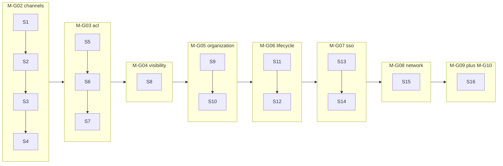

# Coze 治理 16 Session 实施调度

> 本文档是 [plan-coze-platform-governance.md](plan-coze-platform-governance.md) 的执行视图：把治理路线图 §3 的 9 个里程碑（M-G02..M-G10）拆为 16 个 session、43 个 case，并给出 8 个里程碑合并节点。每个 session 必须满足本文 §4 全局 DoD。

## 1. 输入与口径

- **来源**：用户在 2026-04-18 confirm 的 16 session × 43 case 切分。
- **基线**：上一轮已合并 4 个 case（M-G01 全部 + M-G02-C1）→ aliyun/master `e678d3fa`。
- **本工作树**：`cursor/27f23038`（已 push aliyun，已合并入 aliyun/master）。
- **里程碑合并节奏**：8 次 master 合并（每完成一个 M-Gxx 全部 session 后做一次合并 PR）。
- **命名约定**：Assistant ≡ `Agent` 聚合（参见 [docs/coze/assistant-domain-mapping.md](coze/assistant-domain-mapping.md)）。

## 2. 总路线图

## 3. Session 详表

> 每个 session 的最小集：包含 case / 关键交付 / 主要新增或改动文件 / DB / 契约 / 依赖 / 风险。每完成一个 session 立即 commit + push aliyun cursor/27f23038，每个里程碑全部 session 完成后再合入 aliyun/master。

### S1 — M-G02-C2 渠道发布版本与回滚

- **包含 case**：C-G02-C2
- **关键交付**：`WorkspaceChannelRelease` 子聚合 + `IWorkspaceChannelReleaseService`（Create / List / Promote / Rollback）+ `WorkspacePublishChannelsController` 子路由 + `.http` + 集成测
- **主要文件**：
  - `src/backend/Atlas.Domain/AiPlatform/Entities/WorkspacePublishChannel.cs`（追加 ChannelRelease 子实体）
  - `src/backend/Atlas.Application/AiPlatform/Services/IWorkspaceChannelReleaseService.cs`（新增）
  - `src/backend/Atlas.Infrastructure/Services/AiPlatform/WorkspaceChannelReleaseService.cs`（新增）
  - [src/backend/Atlas.AppHost/Controllers/WorkspacePublishChannelsController.cs](../src/backend/Atlas.AppHost/Controllers/WorkspacePublishChannelsController.cs)
  - `src/backend/Atlas.AppHost/Bosch.http/WorkspacePublishChannels.http`（追加 release 用例）
  - `tests/Atlas.SecurityPlatform.Tests/AiPlatform/Channels/WorkspaceChannelReleaseTests.cs`（新增）
- **DB**：新表 `WorkspaceChannelRelease`（Id, ChannelId, AgentPublicationId, ReleaseNo, ReleasedBy, ReleasedAt, Status, RollbackOf）；通过 `AtlasOrmSchemaCatalog` + `DatabaseInitializerHostedService` add-table-if-missing
- **契约**：[docs/contracts.md](contracts.md) 加 release 路由
- **依赖**：M-G02-C1（已完成）
- **风险**：与 `AgentPublication` 关系语义（一对多）；rollback 触发 connector re-publish 顺序

### S2 — M-G02-C3 + M-G02-C4 Web SDK + Open API connector

- **包含 case**：C-G02-C3、C-G02-C4
- **关键交付**：
  - `WebSdkChannelConnector`：HMAC-SHA256 签名 + Origin 白名单 + 运行时下发 snippet（embed token + JS bootstrap）
  - `OpenApiChannelConnector`：tenant token 颁发 + endpoint catalog（chat / task-invoke）+ token bucket 限流
- **主要文件**：
  - `src/backend/Atlas.Infrastructure/Services/AiPlatform/Channels/WebSdkChannelConnector.cs`（新增）
  - `src/backend/Atlas.Infrastructure/Services/AiPlatform/Channels/OpenApiChannelConnector.cs`（新增）
  - `src/backend/Atlas.Infrastructure/Services/AiPlatform/Channels/Signatures/HmacChannelSigner.cs`（新增）
  - `src/backend/Atlas.AppHost/Controllers/Channels/PublicChannelEndpointsController.cs`（新增）
  - `tests/Atlas.SecurityPlatform.Tests/AiPlatform/Channels/WebSdkChannelConnectorTests.cs`、`OpenApiChannelConnectorTests.cs`（新增）
- **DB**：复用 `WorkspacePublishChannel.SecretJson`（已加密），无需新表
- **契约**：是
- **依赖**：S1
- **风险**：限流策略（per-tenant + per-app）；snippet 版本/CDN；HMAC 与 Origin 双校验顺序

### S3 — M-G02-C5..C8 飞书全链路（cred → client → webhook → publish）

- **包含 case**：C-G02-C5、C6、C7、C8
- **关键交付**：
  - `FeishuChannelCredential` + Repository + 凭据加密（沿用 `LowCodeCredentialProtector`）
  - `FeishuApiClient`：tenant_access_token 创建/缓存/刷新（SemaphoreSlim）+ POST `/open-apis/im/v1/messages`
  - `FeishuChannelConnector` + Webhook（`/api/runtime/channels/feishu/{wsId}/webhook`：challenge + `im.message.receive_v1` → Agent 对话）
  - 飞书发布 API + 前端 Tab
- **主要文件**：
  - `src/backend/Atlas.Domain/AiPlatform/Entities/Channels/FeishuChannelCredential.cs`（新增）
  - `src/backend/Atlas.Infrastructure/Repositories/AiPlatform/FeishuChannelCredentialRepository.cs`（新增）
  - `src/backend/Atlas.Infrastructure/Services/AiPlatform/Channels/Feishu/{FeishuApiClient,FeishuChannelConnector}.cs`（新增）
  - `src/backend/Atlas.AppHost/Controllers/Channels/FeishuWebhookController.cs`（新增）
  - `src/frontend/packages/module-studio-react/src/publish/feishu-publish-tab.tsx`（新增）
  - [src/frontend/apps/app-web/src/app/messages.ts](../src/frontend/apps/app-web/src/app/messages.ts)（i18n keys）
  - `tests/Atlas.SecurityPlatform.Tests/AiPlatform/Channels/Feishu*Tests.cs`（新增）
- **DB**：新表 `FeishuChannelCredential`
- **契约**：是
- **依赖**：S1（release）+ S2（HmacChannelSigner 复用）
- **风险**：token 缓存竞态；webhook 事件去重（msg_id idempotency table）

### S4 — M-G02-C9..C11 微信公众号全链路

- **包含 case**：C-G02-C9、C10、C11
- **关键交付**：
  - `WechatMpChannelCredential` + Repository
  - `WechatMpApiClient`：access_token + 客服消息 `/cgi-bin/message/custom/send` + media upload
  - 微信 webhook（XML 解析 + 签名校验）+ 发布 API + 前端 Tab
- **主要文件**：
  - `src/backend/Atlas.Domain/AiPlatform/Entities/Channels/WechatMpChannelCredential.cs`（新增）
  - `src/backend/Atlas.Infrastructure/Services/AiPlatform/Channels/Wechat/{WechatMpApiClient,WechatMpChannelConnector}.cs`（新增）
  - `src/backend/Atlas.AppHost/Controllers/Channels/WechatMpWebhookController.cs`（新增）
  - `src/frontend/packages/module-studio-react/src/publish/wechat-mp-publish-tab.tsx`（新增）
  - `tests/Atlas.SecurityPlatform.Tests/AiPlatform/Channels/WechatMp*Tests.cs`（新增）
- **DB**：新表 `WechatMpChannelCredential`
- **契约**：是
- **依赖**：S3
- **风险**：被动回复 5s 超时（异步 + 客服消息兜底）；XML 编码

> **里程碑合并 1**：M-G02 完成 → push aliyun cursor/27f23038 → 合入 aliyun/master。

### S5 — M-G03-C1 + C2 PDP 资源失效 + ResourceAccessGuard

- **包含 case**：C-G03-C1、C-G03-C2
- **关键交付**：
  - `IPermissionDecisionService.InvalidateResourceAsync(tenant, resourceType, resourceId)` + 资源级 cache tag
  - `IResourceAccessGuard`：三级合并判定（平台 RBAC → 工作空间角色 → 资源 ACL），统一 `RequireAsync(scope, action)` 入口
- **主要文件**：
  - `src/backend/Atlas.Application/Authorization/IResourceAccessGuard.cs`（新增）
  - `src/backend/Atlas.Infrastructure/Services/Authorization/ResourceAccessGuard.cs`（新增）
  - [src/backend/Atlas.Infrastructure/Services/PermissionDecisionService.cs](../src/backend/Atlas.Infrastructure/Services/PermissionDecisionService.cs)
  - `tests/Atlas.SecurityPlatform.Tests/Authorization/ResourceAccessGuardTests.cs`（新增）
- **DB**：否
- **契约**：否（内部抽象）
- **依赖**：无
- **风险**：缓存粒度与一致性；不破坏现有 `RequireWorkspaceAccessAsync`

### S6 — M-G03-C3..C5 各资源 Service 接入 ACL

- **包含 case**：C-G03-C3（Agent）、C-G03-C4（Workflow）、C-G03-C5（App + KB + DB）
- **关键交付**：每个 CommandService 全部写动作 `RequireAsync` + `InvalidateResourceAsync`，每个 service ≥ 1 正例 + 1 反例（403）测试
- **主要文件**：
  - `src/backend/Atlas.Infrastructure/Services/AiPlatform/AgentCommandService.cs`
  - `src/backend/Atlas.Infrastructure/Services/AiPlatform/Workflow/DagWorkflowCommandService.cs`
  - `src/backend/Atlas.Infrastructure/Services/AiPlatform/{AiAppService,KnowledgeBaseService,AiDatabaseService}.cs`
  - `tests/Atlas.SecurityPlatform.Tests/AiPlatform/*AclTests.cs`
- **DB**：否
- **契约**：可能 — 反向用例 `403` vs `404` 需在 contracts.md 标注
- **依赖**：S5
- **风险**：写动作多查 1 次 PDP 的 RT；现有兼容层若假设宽授权需同步改

### S7 — M-G03-C6 + C7 协作者真实数据 + CRUD + 前端抽屉

- **包含 case**：C-G03-C6、C-G03-C7
- **关键交付**：
  - `WorkflowCompatServices.ListAsync` / Coze 兼容层 `list_collaborators` 改读 `WorkspaceResourcePermission`
  - 协作者 CRUD `POST/PATCH/DELETE /api/v1/resources/{type}/{id}/collaborators` + `CollaboratorDrawer` 沉淀到 `shared-react-core`
- **主要文件**：
  - [src/backend/Atlas.Infrastructure/Services/AiPlatform/WorkflowCompatServices.cs](../src/backend/Atlas.Infrastructure/Services/AiPlatform/WorkflowCompatServices.cs)
  - `src/backend/Atlas.Application/AiPlatform/Services/IResourceCollaboratorService.cs`（新增）
  - `src/backend/Atlas.Infrastructure/Services/AiPlatform/ResourceCollaboratorService.cs`（新增）
  - `src/backend/Atlas.Presentation.Shared/Controllers/Ai/ResourceCollaboratorsController.cs`（新增）
  - `src/frontend/packages/shared-react-core/src/components/CollaboratorDrawer/*`（新增）
  - i18n + vitest
- **DB**：可能 — `WorkspaceResourcePermission` 新增组合索引（tenant, resource_type, resource_id）
- **契约**：是
- **依赖**：S5 + S6
- **风险**：宽列表行为变更影响 Coze 客户端 → 灰度 / `?scope=all` 兜底

> **里程碑合并 2**：M-G03 完成 → 合入 aliyun/master。

### S8 — M-G04-C1..C4 审计 / 消息日志可见性

- **包含 case**：C-G04-C1、C2、C3、C4
- **关键交付**：
  - `AuditRecord` 增列 `ResourceType` / `ResourceId` + 全局写入点回填
  - `IResourceVisibilityResolver` + `AuditQueryService` 默认收缩到 owner + collaborator
  - `RuntimeMessageLogService` 与仓储可见性过滤
  - AppHost 的 `RuntimeTracesController` / `RuntimeMessageLogController` 接入可见性
- **主要文件**：
  - `src/backend/Atlas.Domain/Audit/Entities/AuditRecord.cs`
  - `src/backend/Atlas.Application/Audit/IResourceVisibilityResolver.cs`（新增）
  - [src/backend/Atlas.Infrastructure/Services/AuditQueryService.cs](../src/backend/Atlas.Infrastructure/Services/AuditQueryService.cs)
  - `src/backend/Atlas.Infrastructure/Services/LowCode/RuntimeMessageLogService.cs`（或 `RuntimeSessionAndChatflowServices.cs`）
  - `src/backend/Atlas.AppHost/Controllers/RuntimeTracesController.cs` / `RuntimeMessageLogController.cs`
- **DB**：是 — `AuditRecord` 增列 + 索引
- **契约**：可能 — 列表行为收窄（admin 用 `?scope=all` 兜底）
- **依赖**：S5 + S6 + S7
- **风险**：旧客户端依赖宽列表；消息日志数据量大，索引补齐前慢查询

> **里程碑合并 3**：M-G04 完成 → 合入 aliyun/master。

### S9 — M-G05-C1 + C2 Organization 实体 + Workspace 数据回填

- **包含 case**：C-G05-C1、C-G05-C2
- **关键交付**：
  - `Organization` 实体 + `OrganizationService` + Controller + 默认组织 bootstrap（每 tenant 注入 1 个 Default Org）
  - `Workspace.OrganizationId` 列 + 数据回填 + 服务层强制传入
- **主要文件**：
  - `src/backend/Atlas.Domain/Identity/Entities/Organization.cs`（新增）
  - `src/backend/Atlas.Infrastructure/Services/OrganizationService.cs`（新增）
  - `src/backend/Atlas.AppHost/Controllers/OrganizationsController.cs`（新增或追加）
  - `src/backend/Atlas.Infrastructure/Hosting/DatabaseInitializerHostedService.cs`（追加 backfill）
  - [src/backend/Atlas.Domain/AiPlatform/Entities/WorkspaceEntities.cs](../src/backend/Atlas.Domain/AiPlatform/Entities/WorkspaceEntities.cs)
- **DB**：是 — 新表 `Organization`；`Workspace` 增列 `OrganizationId`（nullable → backfill → non-null 三阶段）
- **契约**：是
- **依赖**：无；S10/S11/S12 前置
- **风险**：迁移破坏；前端路由 `/orgs/:orgId/workspaces/:wsId` 暂保留兼容

### S10 — M-G05-C3..C5 TenantContext + Member + 跨组织迁移

- **包含 case**：C-G05-C3、C4、C5
- **关键交付**：
  - `ITenantContext` 增 `OrganizationId` + middleware + JWT claim `org_id`
  - `OrganizationMember` + `OrganizationRole` + Service
  - 跨组织迁移 API（`PATCH /api/v1/workspaces/{wsId}/move`）+ 事务（更新 OrgId + PDP 失效 + Audit）
- **主要文件**：
  - `src/backend/Atlas.Application/Tenancy/ITenantContext.cs`、`TenantContext.cs`
  - `src/backend/Atlas.AppHost/Middlewares/TenantOrganizationMiddleware.cs`（新增）
  - `src/backend/Atlas.AppHost/Auth/JwtTokenService.cs`
  - `src/backend/Atlas.Domain/Identity/Entities/{OrganizationMember,OrganizationRole}.cs`（新增）
- **DB**：是 — 新表 OrganizationMember / OrganizationRole；`Workspace.OrganizationId` 转 non-null
- **契约**：是 — JWT 字段；可选 `/api/v1/orgs/{orgId}/...` 路由
- **依赖**：S9
- **风险**：旧 JWT 无 `org_id` → middleware fallback Default Org

> **里程碑合并 4**：M-G05 完成 → 合入 aliyun/master。

### S11 — M-G06-C1 + C2 邀请 + 状态机

- **包含 case**：C-G06-C1、C-G06-C2
- **关键交付**：
  - `MemberInvitation` 域（token / expiresAt / redeemBy）+ `SmtpEmailSender`（MailKit）+ accept / revoke API
  - `UserAccount.Status` 状态机（Active / PendingActivation / Disabled / Offboarded）+ 登录拒绝
- **主要文件**：
  - `src/backend/Atlas.Domain/Identity/Entities/MemberInvitation.cs`（新增）
  - `src/backend/Atlas.Infrastructure/Services/MemberInvitationService.cs`（新增）
  - `src/backend/Atlas.Infrastructure/Services/Notifications/SmtpEmailSender.cs`（新增）
  - `src/backend/Atlas.AppHost/Controllers/MemberInvitationsController.cs`（新增）
  - [src/backend/Atlas.Domain/Identity/Entities/UserAccount.cs](../src/backend/Atlas.Domain/Identity/Entities/UserAccount.cs) + `AuthController.cs`
- **DB**：是 — 新表 MemberInvitation；UserAccount 增列 Status
- **契约**：是
- **依赖**：S9
- **风险**：SMTP secrets；状态迁移向后兼容（默认 Active）

### S12 — M-G06-C3 + C4 离职 + 资产移交 + 组织间迁移

- **包含 case**：C-G06-C3、C-G06-C4
- **关键交付**：
  - `ResourceOwnershipTransfer` + offboard 一键流程（标记 Offboarded → 资源 owner 转给继任人 → 协作者权限回收 → audit）
  - 组织间成员迁移（`PATCH /api/v1/orgs/{orgId}/members/{userId}/move`）+ 角色回收
- **主要文件**：
  - `src/backend/Atlas.Domain/Identity/Entities/ResourceOwnershipTransfer.cs`（新增）
  - `src/backend/Atlas.Infrastructure/Services/OffboardService.cs`（新增）
  - `src/backend/Atlas.AppHost/Controllers/OffboardController.cs`（新增）
- **DB**：是 — 新表 ResourceOwnershipTransfer
- **契约**：是
- **依赖**：S10 + S11
- **风险**：批量移交事务跨多资源类型；幂等

> **里程碑合并 5**：M-G06 完成 → 合入 aliyun/master。

### S13 — M-G07-C1..C3 SAML 库 + 租户级 IdP store + 动态 OIDC

- **包含 case**：C-G07-C1、C2、C3
- **关键交付**：
  - 引入 NuGet `ITfoxtec.Identity.Saml2.MvcCore` + 自定义 `SamlAuthenticationHandler`
  - `TenantIdentityProvider` 实体 + Service + CRUD API（含 SAML metadata + cert 加密存储）
  - `DynamicOidcSchemeProvider` 取代部署级 OIDC 注册（`IAuthenticationSchemeProvider` + 缓存 + 失效）
- **主要文件**：
  - `src/backend/Atlas.Infrastructure/Security/Saml/SamlAuthenticationHandler.cs`（新增）
  - `src/backend/Atlas.Domain/Identity/Entities/TenantIdentityProvider.cs`（新增）
  - `src/backend/Atlas.Infrastructure/Services/TenantIdentityProviderService.cs`（新增）
  - `src/backend/Atlas.AppHost/Controllers/TenantIdentityProvidersController.cs`（新增）
  - `src/backend/Atlas.Infrastructure/Security/DynamicOidcSchemeProvider.cs`（新增）
  - [src/backend/Atlas.AppHost/Program.cs](../src/backend/Atlas.AppHost/Program.cs)（替换 AddOpenIdConnect 静态注册）
- **DB**：是 — 新表 TenantIdentityProvider
- **契约**：是
- **依赖**：S9 + S10
- **风险**：NuGet 许可证（ITfoxtec MIT）；动态 scheme 解析性能

### S14 — M-G07-C4 + C5 SAML SP 全链路 + 登录策略

- **包含 case**：C-G07-C4、C-G07-C5
- **关键交付**：
  - SAML SP metadata / login / ACS / SLO 全链路（路由 `/sso/saml/{tenantId}/...`）
  - `SsoLoginPolicyService`：首次登录自动加入默认组织 / 空间（IdP 映射规则）
- **主要文件**：
  - `src/backend/Atlas.AppHost/Controllers/Sso/SamlSpController.cs`（新增）
  - `src/backend/Atlas.Infrastructure/Services/Sso/SsoLoginPolicyService.cs`（新增）
  - [src/backend/Atlas.Infrastructure/Services/UserCommandService.cs](../src/backend/Atlas.Infrastructure/Services/UserCommandService.cs)（首次登录创建 + join）
  - `tests/Atlas.SecurityPlatform.Tests/Sso/SamlSpTests.cs`（新增，mock IdP metadata + ACS round-trip）
- **DB**：可能 — SsoLoginEvent 审计
- **契约**：是
- **依赖**：S13
- **风险**：SAML round-trip 需 IdP 模拟；签名/加密配置错误难调试

> **里程碑合并 6**：M-G07 完成 → 合入 aliyun/master。

### S15 — M-G08-C1 + C2 网络策略 + 数据驻留

- **包含 case**：C-G08-C1、C-G08-C2
- **关键交付**：
  - `TenantNetworkPolicy` + IP middleware（Audit / Enforce 双模式，CIDR allowlist + denylist）
  - `TenantDataResidencyPolicy`（region + storage endpoint mapping）+ 存储端点解析器真实拒绝跨区
- **主要文件**：
  - `src/backend/Atlas.Domain/Identity/Entities/{TenantNetworkPolicy,TenantDataResidencyPolicy}.cs`（新增）
  - `src/backend/Atlas.AppHost/Middlewares/TenantNetworkPolicyMiddleware.cs`（新增）
  - `src/backend/Atlas.Infrastructure/Storage/ObjectStorageEndpointResolver.cs`（重构 + 接 policy）
- **DB**：是 — 2 张策略表
- **契约**：是
- **依赖**：S9
- **风险**：CIDR 解析性能；全 worker 部署中间件

> **里程碑合并 7**：M-G08 完成 → 合入 aliyun/master。

### S16 — M-G09-C1 + M-G10-C1..C4 差异表 + AgentTrigger / AgentCard 全套

- **包含 case**：C-G09-C1、C-G10-C1、C2、C3、C4
- **关键交付**：
  - `docs/coze-open-vs-cn-commercial.md` 完整差异表（功能模块 × 开源 vs 商用 vs Atlas 现状）
  - `AgentTrigger` 实体 + Service + Controller + 复用 M12 trigger 引擎
  - `AgentCard` 实体 + 飞书 / 微信卡片渲染联动
  - Coze 兼容层 `trigger` / `card` 切真实数据
  - `AgentWorkbench` 增 Triggers / Cards Tab + i18n + vitest
- **主要文件**：
  - `docs/coze-open-vs-cn-commercial.md`（新增）
  - `src/backend/Atlas.Domain/AiPlatform/Entities/Agent/{AgentTrigger,AgentCard}.cs`（新增）
  - `src/backend/Atlas.Infrastructure/Services/AiPlatform/{AgentTriggerService,AgentCardRenderingService}.cs`（新增）
  - [src/backend/Atlas.Presentation.Shared/Controllers/Ai/CozeWorkflowCompatControllerBase.cs](../src/backend/Atlas.Presentation.Shared/Controllers/Ai/CozeWorkflowCompatControllerBase.cs)（trigger / card 接真实数据）
  - [src/frontend/packages/module-studio-react/src/assistant/agent-workbench.tsx](../src/frontend/packages/module-studio-react/src/assistant/agent-workbench.tsx)
- **DB**：是 — 新表 AgentTrigger + AgentCard
- **契约**：是
- **依赖**：S3 + S4（飞书 / 微信渠道用于卡片渲染）
- **风险**：触发执行复用 M12 不引入循环依赖

> **里程碑合并 8**：M-G09 + M-G10 完成 → 合入 aliyun/master，governance 全部交付。

## 4. 全局 DoD（每个 session 必过）

| 维度 | 命令 / 动作 |
| --- | --- |
| 后端编译 | `dotnet build Atlas.SecurityPlatform.slnx -c Release` 0 警告 0 错误 |
| 后端测试 | `dotnet test tests/Atlas.SecurityPlatform.Tests` 受影响模块全过；新代码至少 1 正例 + 1 反例 |
| 前端构建 | `cd src/frontend && pnpm run build`（涉及前端时） |
| 前端单测 | `pnpm run test:unit`（涉及前端时） |
| i18n | `pnpm run i18n:check` 0 缺失（涉及用户可见文案时） |
| API 用例 | `src/backend/Atlas.AppHost/Bosch.http/` 或 `Atlas.AppHost/Bosch.http/` 同步用例 |
| 契约 | 凡对外 REST 变更同步 [docs/contracts.md](contracts.md) |
| 零占位 | 全文搜索 `TODO` / `NotImplementedException` / 空集合返回 stub，本 session 涉及文件 0 命中 |
| Schema | 新增表 / 列同步进 `AtlasOrmSchemaCatalog` + `DatabaseInitializerHostedService` add-if-missing |
| 凭据 | 涉及外部凭据时统一使用 `LowCodeCredentialProtector` 加密 |

## 5. 提交与合并策略

- **每 session**：完成 → DoD 全过 → `git commit -F tmp/commit-Sx.txt` → `git push aliyun cursor/27f23038`。
- **每里程碑**：本里程碑全部 session 完成后，`git checkout -B integrate/<milestone> aliyun/master` → `git merge cursor/27f23038 -m "merge: M-Gxx ..."` → `dotnet build` + 关键 `dotnet test` → `git push aliyun integrate/<milestone>:master`。
- **8 个合并点**：M-G02 / M-G03 / M-G04 / M-G05 / M-G06 / M-G07 / M-G08 / (M-G09 + M-G10)。

## 6. 关键风险与回退

1. **Tenant ↔ Organization 解耦**：S9 / S10 涉及 `TenantContext` + JWT + 全量查询；分阶段（nullable → backfill → non-null）。
2. **PDP 缓存一致性**：S5 引入资源级 cache tag；S6 / S7 / S8 写动作同步失效，避免延迟。
3. **Coze 兼容层行为变更**：S7 / S16 把 stub 切真实数据，旧客户端可能崩；保留 `?scope=all` / 灰度 header。
4. **外部 NuGet**：S13 引入 `ITfoxtec.Identity.Saml2.MvcCore` 前先确认许可证（MIT）+ NuGet feed 可达。
5. **SMTP / 飞书 / 微信凭据**：所有外部凭据走 `LowCodeCredentialProtector`，secrets 不入仓。
6. **回退**：每个里程碑合并后保留 tag `governance-mgxx-pre-merge`；如线上回归可 `git revert <merge-sha>`。

### 6.1 P2 批次库解耦约定（R1 fill-the-gaps 起承接）

R1 把"前端组件已写但没挂"+"后端读路径没真正切换"（B1–B4 / F1–F4）落地完毕。后续 P2 批次（SAML 运行时 / DynamicOIDC / IP allow-deny middleware / DataResidency endpoint resolver / MailKit SMTP）**统一收敛到新 Class Library `Atlas.Identity.SsoExtensions`**：

- **范围**（按 P2 进入顺序）：
  1. `Atlas.Identity.SsoExtensions.Saml`：SAML2 SP/IdP 完整流（替换 `SamlSpController` 占位 + 引入 `ITfoxtec.Identity.Saml2.MvcCore`）。
  2. `Atlas.Identity.SsoExtensions.Oidc`：`DynamicOidcSchemeProvider`（按 `TenantIdentityProvider` 动态注册 OIDC scheme）。
  3. `Atlas.Identity.SsoExtensions.Network`：`IpAllowDenyMiddleware`（消费 `TenantNetworkPolicy.Allowlist/Denylist`，支持 audit / enforce 模式）。
  4. `Atlas.Identity.SsoExtensions.Residency`：`DataResidencyEndpointResolver`（按 `TenantDataResidencyPolicy.AllowedRegions` 路由后端服务调用）。
  5. `Atlas.Identity.SsoExtensions.Mail`：MailKit SMTP 实现替换 `SmtpInvitationEmailSender` 占位。
- **依赖边界**：`Atlas.Identity.SsoExtensions` 仅依赖 `Atlas.Application` + `Atlas.Core` + `Atlas.Domain.Identity`；**禁止** 反向引用 `Atlas.Infrastructure`，也不让 `Atlas.Infrastructure` 顶层堆运行时插件（避免 DI 循环 + 镜像膨胀）。
- **DI 注入入口**：在 `src/backend/Atlas.AppHost/Program.cs` 中由 `services.AddIdentitySsoExtensions(configuration)` 单点开关；未启用时不影响现有登录流程（OIDC / SAML 走 stub / 501）。
- **回退**：库可单独 `<PackageReference Remove="..." />` 临时关闭，保持治理快照可回退；`SamlSpController` 占位行为保留作 fallback。

本批（R1）**不创建** `Atlas.Identity.SsoExtensions`；仅作约定备案。R2 起按上述顺序按需逐个落地。

## 7. 进度追踪

| Session | 里程碑 | 包含 case 数 | 状态 |
| --- | --- | --- | --- |
| S1 | M-G02 | 1 | pending |
| S2 | M-G02 | 2 | pending |
| S3 | M-G02 | 4 | pending |
| S4 | M-G02 | 3 | pending |
| S5 | M-G03 | 2 | pending |
| S6 | M-G03 | 3 | pending |
| S7 | M-G03 | 2 | pending |
| S8 | M-G04 | 4 | pending |
| S9 | M-G05 | 2 | pending |
| S10 | M-G05 | 3 | pending |
| S11 | M-G06 | 2 | pending |
| S12 | M-G06 | 2 | pending |
| S13 | M-G07 | 3 | pending |
| S14 | M-G07 | 2 | pending |
| S15 | M-G08 | 2 | pending |
| S16 | M-G09 + M-G10 | 5 | pending |
| **合计** | 8 个里程碑 | **42** | — |

> 备注：原列表 43 case 与上表合计 42 的差异源于 M-G02 / M-G03 / M-G05 / M-G06 / M-G07 内子 case 计数；以本表 session × case 矩阵为准（与 16 session 切分一致），确认时若有偏差以 [plan-coze-platform-governance.md](plan-coze-platform-governance.md) 章节为准。
