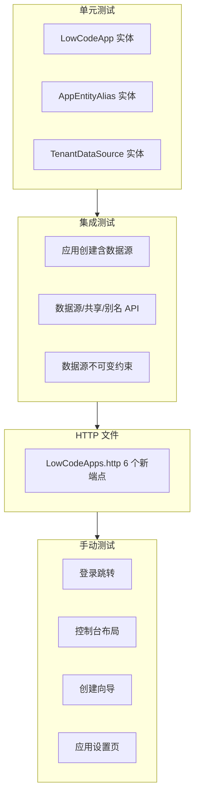

# 平台控制台与应用数据源 - 完整闭环测试计划

> 本文档为 `docs/plan-平台控制台与应用数据源.md` 的配套测试计划，覆盖后端单元/集成测试、HTTP 测试、前端手动测试及回归验证。

---

## 一、测试分层与执行顺序



**执行命令**：
- 单元/集成：`dotnet test tests/Atlas.SecurityPlatform.Tests --filter "FullyQualifiedName!~Integration"`
- 集成：`dotnet test tests/Atlas.SecurityPlatform.Tests --filter "FullyQualifiedName~Integration"`
- HTTP：REST Client 执行 `Bosch.http/LowCodeApps.http` 中对应请求

---

## 二、后端单元测试

### 2.1 LowCodeApp 实体测试

**文件**：`tests/Atlas.SecurityPlatform.Tests/Domain/LowCodeAppTests.cs`（新建）

| 用例 ID | 用例名称 | 步骤 | 预期 |
|---------|----------|------|------|
| U-LCA-01 | 构造函数设置 DataSourceId 后不可通过 Update 修改 | 创建带 dataSourceId 的 LowCodeApp，调用 Update(name, desc, ...) | DataSourceId 保持不变 |
| U-LCA-02 | 构造函数设置 UseSharedUsers/Roles/Departments | 创建时传入 useSharedUsers=false | 属性为 false |
| U-LCA-03 | 默认 UseShared 为 true | 创建时未传 useShared* | 三个属性均为 true |
| U-LCA-04 | UpdateSharingPolicy 可修改共享策略 | 调用 UpdateSharingPolicy(false, false, true) | UseSharedUsers/Roles 为 false，Departments 为 true |

### 2.2 AppEntityAlias 实体测试

**文件**：`tests/Atlas.SecurityPlatform.Tests/Domain/AppEntityAliasTests.cs`（新建）

| 用例 ID | 用例名称 | 步骤 | 预期 |
|---------|----------|------|------|
| U-AEA-01 | Update 更新 SingularAlias 和 PluralAlias | 创建后调用 Update("员工", "员工列表") | 属性正确更新 |
| U-AEA-02 | PluralAlias 可为 null | Update("员工", null) | PluralAlias 为 null |

### 2.3 TenantDataSource 实体测试

**文件**：`tests/Atlas.SecurityPlatform.Tests/Domain/TenantDataSourceTests.cs`（新建）

| 用例 ID | 用例名称 | 步骤 | 预期 |
|---------|----------|------|------|
| U-TDS-01 | RecordTestResult 更新 LastTestSuccess 和 LastTestedAt | 调用 RecordTestResult(true) | LastTestSuccess=true，LastTestedAt 有值 |
| U-TDS-02 | AppId 可为 null（平台级） | 创建时 AppId=null | 表示平台级数据源 |

---

## 三、后端集成测试

### 3.1 应用创建与数据源绑定

**文件**：`tests/Atlas.SecurityPlatform.Tests/Integration/LowCodeAppDatasourceIntegrationTests.cs`（新建）

| 用例 ID | 用例名称 | 步骤 | 预期 |
|---------|----------|------|------|
| I-CREATE-01 | 创建应用使用平台默认数据源 | POST 创建，dataSourceId=null，useShared*=true | 201，返回 appId，DataSourceId 为 null |
| I-CREATE-02 | 创建应用绑定已有数据源 | 先创建 TenantDataSource，再创建应用并传 dataSourceId | 201，应用 DataSourceId 正确 |
| I-CREATE-03 | 创建应用时 UseSharedUsers=false 且无 DataSourceId 应失败 | dataSourceId=null，useSharedUsers=false | 400，校验错误 |
| I-CREATE-04 | 创建应用需 Idempotency-Key | POST 无 Idempotency-Key | 400，ErrorCodes.IdempotencyRequired |
| I-CREATE-05 | 创建应用需 X-CSRF-TOKEN | POST 无 X-CSRF-TOKEN | 401 或 400 |

### 3.2 数据源只读与测试连接

| 用例 ID | 用例名称 | 步骤 | 预期 |
|---------|----------|------|------|
| I-DS-01 | GET /{id}/datasource 返回脱敏视图 | 创建带数据源的应用后 GET | 200，含 dataSourceId、name、dbType、lastTestSuccess，无 connectionString |
| I-DS-02 | GET /{id}/datasource 平台默认数据源应用 | 创建 dataSourceId=null 的应用后 GET | 200，dataSourceId 为 null 或空 |
| I-DS-03 | POST /{id}/datasource/test 测试连接成功 | 对有效数据源调用 test | 200，success=true |
| I-DS-04 | 未认证访问 datasource 返回 401 | 无 Authorization 调用 GET | 401 |
| I-DS-05 | 跨租户访问 datasource 返回 403 或 404 | 租户 A 的应用，租户 B 的 token 访问 | 403 或 404 |

### 3.3 共享策略 API

| 用例 ID | 用例名称 | 步骤 | 预期 |
|---------|----------|------|------|
| I-SP-01 | GET /{id}/sharing-policy 返回当前策略 | 创建应用后 GET | 200，useSharedUsers/Roles/Departments 正确 |
| I-SP-02 | PUT /{id}/sharing-policy 更新策略 | PUT useSharedUsers=false | 200，再 GET 验证 |
| I-SP-03 | PUT 需 Idempotency-Key 和 X-CSRF-TOKEN | PUT 无幂等/CSRF | 400 |
| I-SP-04 | 不存在的 appId 返回 404 | GET/PUT appId=999999 | 404 |

### 3.4 实体别名 API

| 用例 ID | 用例名称 | 步骤 | 预期 |
|---------|----------|------|------|
| I-AL-01 | GET /{id}/entity-aliases 初始为空或默认 | 新建应用 GET | 200，空数组或默认 3 条 |
| I-AL-02 | PUT /{id}/entity-aliases 批量更新 | PUT [{entityType:"user", singularAlias:"员工", pluralAlias:"员工列表"}] | 200 |
| I-AL-03 | PUT 后 GET 验证持久化 | PUT 后立即 GET | 返回与 PUT 一致 |
| I-AL-04 | PUT 需 Idempotency-Key 和 X-CSRF-TOKEN | PUT 无幂等/CSRF | 400 |

### 3.5 数据源不可变约束

| 用例 ID | 用例名称 | 步骤 | 预期 |
|---------|----------|------|------|
| I-IMMUT-01 | PUT /{id} 请求体不含 dataSourceId | 更新应用时 DTO 无 dataSourceId 字段 | 接口层物理隔离，无法传入 |
| I-IMMUT-02 | 不存在「更新数据源」的 API | 搜索 PUT/PATCH datasource | 无此类端点 |

### 3.6 应用本地数据库集成测试（必选）

**目标**：验证至少一个应用能绑定并使用独立本地数据库，读写操作落在该库而非平台库。

**文件**：`tests/Atlas.SecurityPlatform.Tests/Integration/AppLocalDatabaseIntegrationTests.cs`（新建）

| 用例 ID | 用例名称 | 步骤 | 预期 |
|---------|----------|------|------|
| I-LDB-01 | 应用绑定 SQLite 本地库并完成读写 | 1) 创建 TenantDataSource，连接串指向临时文件 `Data Source={Path.GetTempPath()}/test_app_{Guid}.db`<br>2) 创建 LowCodeApp 并绑定该 dataSourceId<br>3) 在该应用下创建页面或动态表<br>4) 查询并验证数据存在 | 创建/查询成功，数据写入应用专属库 |
| I-LDB-02 | 应用本地库测试连接成功 | 对 I-LDB-01 中创建的数据源调用 POST /datasource/test | 200，success=true |
| I-LDB-03 | 测试后清理临时库文件 | 测试结束前删除 `test_app_*.db` | 无残留文件（或由测试框架 Dispose 清理） |
| I-LDB-04 | 应用本地库首次初始化 schema | 绑定新的本地 SQLite 库后执行首次业务写入 | 首次访问可自动建表或初始化成功 |
| I-LDB-05 | 服务重启后应用本地库可再次访问 | 创建本地库并写入数据后重启应用，再次查询 | 历史数据可读取，连接正常 |
| I-LDB-06 | 本地库路径非法或不可写时返回脱敏错误 | 使用非法路径/只读目录创建并测试连接 | 返回失败且错误信息不泄露底层敏感路径细节 |

**实现要点**：
- 使用 `Path.Combine(Path.GetTempPath(), $"test_app_{Guid.NewGuid():N}.db")` 保证隔离
- 若当前架构尚未支持「按 AppId 切换数据源」，该用例可先验证「创建+绑定+测试连接」链路，待运行时切换实现后再补充读写验证

### 3.7 幂等语义测试（必补）

| 用例 ID | 用例名称 | 步骤 | 预期 |
|---------|----------|------|------|
| I-IDEM-01 | 同一 Idempotency-Key + 相同 payload 重放 | 对创建应用或更新共享策略接口重复发送两次相同请求 | 返回相同业务结果，不重复创建/写入 |
| I-IDEM-02 | 同一 Idempotency-Key + 不同 payload 冲突 | 第一次请求成功后，复用同一幂等键发送不同请求体 | 返回幂等键冲突错误 |
| I-IDEM-03 | 不同 Idempotency-Key 可正常重复操作 | 使用不同幂等键发送两次合法请求 | 各自独立处理，行为符合接口语义 |

### 3.8 审计与脱敏测试（必补）

| 用例 ID | 用例名称 | 步骤 | 预期 |
|---------|----------|------|------|
| I-AUDIT-01 | 创建应用写入审计日志 | 创建应用后查询审计记录 | 有对应创建事件、操作者、时间、租户信息 |
| I-AUDIT-02 | 测试数据源连接写入审计日志 | 调用 `/datasource/test` 后查询审计记录 | 有测试连接事件，结果成功/失败可追踪 |
| I-AUDIT-03 | 更新共享策略写入审计日志 | 更新 sharing-policy 后查询审计记录 | 有更新事件和对象标识 |
| I-AUDIT-04 | 更新实体别名写入审计日志 | 更新 entity-aliases 后查询审计记录 | 有更新事件和对象标识 |
| I-AUDIT-05 | 审计与接口响应中不暴露连接串/密码 | 查看接口响应、错误信息、审计记录 | 不包含 connectionString、password 明文 |

### 3.9 事务与回滚测试（推荐高优先）

| 用例 ID | 用例名称 | 步骤 | 预期 |
|---------|----------|------|------|
| I-TX-01 | 创建应用失败时不留下孤儿绑定关系 | 人为制造创建应用后续失败 | 不产生半成功应用记录或脏关系数据 |
| I-TX-02 | 更新共享策略失败不应部分写入 | 在更新流程中制造异常 | 三个共享字段保持原值 |
| I-TX-03 | 批量更新实体别名失败不应半成功 | 提交多条别名并在中途制造异常 | 要么全部成功，要么全部回滚 |

### 3.10 推荐补充测试

| 用例 ID | 用例名称 | 步骤 | 预期 | 优先级 |
|---------|----------|------|------|--------|
| I-REC-01 | 应用间数据隔离 | 创建 AppA（数据源 A）、AppB（数据源 B），在 A 下创建页面，查询 B 的页面列表 | B 的列表不包含 A 的页面 | 高 |
| I-REC-02 | 平台默认 vs 应用专属 | App1 无 DataSourceId，App2 有；分别创建页面后，验证各自数据落在正确库 | 平台库仅含 App1 数据，App2 库仅含 App2 数据 | 高 |
| I-REC-03 | 无效数据源创建应用应失败 | 传 dataSourceId=999999（不存在）创建应用 | 400，校验或 404 | 中 |
| I-REC-04 | 数据源属于其他租户时拒绝绑定 | 租户 A 创建 TenantDataSource，租户 B 创建应用并传该 dataSourceId | 400 或 403 | 中 |
| I-REC-05 | 连接串脱敏不泄露 | GET /datasource、审计日志、异常消息 | 均不包含 password、ConnectionString 明文 | 高（等保） |
| I-REC-06 | 多驱动 Smoke（可选） | 若有 MySQL/PostgreSQL 测试环境，创建对应 TenantDataSource 并测试连接 | 200，success=true | 低（按需） |

---

## 四、HTTP 文件测试（LowCodeApps.http）

**文件**：`src/backend/Atlas.WebApi/Bosch.http/LowCodeApps.http`

在现有文件末尾追加以下 6 个请求块，变量沿用 `@accessToken`、`@csrfToken`、`@appId`：

```http
###############################################
# 应用数据源 / 共享策略 / 实体别名（新增）
###############################################

### 获取应用数据源（只读，脱敏）
GET {{baseUrl}}/api/v1/lowcode-apps/{{appId}}/datasource
Authorization: Bearer {{accessToken}}
X-Tenant-Id: {{tenantId}}

### 测试应用数据源连接
POST {{baseUrl}}/api/v1/lowcode-apps/{{appId}}/datasource/test
Authorization: Bearer {{accessToken}}
X-Tenant-Id: {{tenantId}}
Idempotency-Key: {{$randomUUID}}
X-CSRF-TOKEN: {{csrfToken}}
Content-Type: application/json

{}

### 获取共享策略
GET {{baseUrl}}/api/v1/lowcode-apps/{{appId}}/sharing-policy
Authorization: Bearer {{accessToken}}
X-Tenant-Id: {{tenantId}}

### 更新共享策略（需幂等+CSRF）
PUT {{baseUrl}}/api/v1/lowcode-apps/{{appId}}/sharing-policy
Authorization: Bearer {{accessToken}}
X-Tenant-Id: {{tenantId}}
Idempotency-Key: {{$randomUUID}}
X-CSRF-TOKEN: {{csrfToken}}
Content-Type: application/json

{
  "useSharedUsers": false,
  "useSharedRoles": true,
  "useSharedDepartments": true
}

### 获取实体别名
GET {{baseUrl}}/api/v1/lowcode-apps/{{appId}}/entity-aliases
Authorization: Bearer {{accessToken}}
X-Tenant-Id: {{tenantId}}

### 更新实体别名（需幂等+CSRF）
PUT {{baseUrl}}/api/v1/lowcode-apps/{{appId}}/entity-aliases
Authorization: Bearer {{accessToken}}
X-Tenant-Id: {{tenantId}}
Idempotency-Key: {{$randomUUID}}
X-CSRF-TOKEN: {{csrfToken}}
Content-Type: application/json

{
  "aliases": [
    { "entityType": "user", "singularAlias": "员工", "pluralAlias": "员工列表" },
    { "entityType": "role", "singularAlias": "岗位", "pluralAlias": "岗位列表" },
    { "entityType": "department", "singularAlias": "部门", "pluralAlias": "部门列表" }
  ]
}
```

**验收**：后端启动后，在 VS Code REST Client 中依次执行上述请求，均返回 200（或符合业务逻辑的 4xx）。

---

## 五、前端手动测试场景

### 5.1 登录与入口

| 用例 ID | 用例名称 | 步骤 | 预期 |
|---------|----------|------|------|
| M-LOGIN-01 | 登录成功后跳转 /console | 输入租户+账号密码登录 | 跳转到 /console，显示应用卡片网格 |
| M-LOGIN-02 | 已登录访问 /login 重定向 /console | 已登录状态下访问 /login | 重定向到 /console |
| M-LOGIN-03 | redirect 参数优先 | 访问 /login?redirect=/apps/1/dashboard | 登录后跳转到 /apps/1/dashboard |

### 5.2 平台控制台布局

| 用例 ID | 用例名称 | 步骤 | 预期 |
|---------|----------|------|------|
| M-CON-01 | 纯顶部导航无侧边栏 | 进入 /console | 仅顶部导航，无左侧菜单 |
| M-CON-02 | 顶部 Tab 可切换 | 点击「应用」「数据源」「设置」 | 路由切换，内容区更新 |
| M-CON-03 | 用户下拉正常 | 点击头像/用户名 | 显示个人中心、退出登录 |
| M-CON-04 | 点击应用卡片进入工作台 | 点击某应用卡片 | 跳转 /apps/{id}/dashboard |

### 5.3 应用创建向导

| 用例 ID | 用例名称 | 步骤 | 预期 |
|---------|----------|------|------|
| M-WIZ-01 | 步骤 1 基本信息校验 | 不填 appKey 点下一步 | 校验失败，无法下一步 |
| M-WIZ-02 | 步骤 2 平台默认可下一步 | 选「平台默认」 | 可直接下一步 |
| M-WIZ-03 | 步骤 2 创建新数据源需测试通过 | 选「创建新」、填 SQLite :memory:、不点测试 | 下一步禁用或提示 |
| M-WIZ-04 | 步骤 2 测试连接通过后可下一步 | 填有效连接、点测试连接 | 显示成功，可下一步 |
| M-WIZ-05 | 步骤 2 显示不可更改警告 | 进入步骤 2 | 可见「数据源绑定后不可更改」提示 |
| M-WIZ-06 | 步骤 3 UseShared=false 且无数据源时校验 | 选应用独立、未选数据源 | 提示需配置数据源 |
| M-WIZ-07 | 完整创建流程 | 三步填完并提交 | 创建成功，列表出现新应用 |
| M-WIZ-08 | 创建后 DataSourceId 不可改 | 进入应用设置 > 数据源 | 仅只读展示，无编辑入口 |

### 5.4 应用工作台

| 用例 ID | 用例名称 | 步骤 | 预期 |
|---------|----------|------|------|
| M-WS-01 | 左侧显示应用名和返回链接 | 进入 /apps/{id}/dashboard | 有应用名、「返回控制台」链接 |
| M-WS-02 | 侧边菜单为应用专属 | 查看侧边栏 | 仪表盘、表单、设计器、审批、工作流、设置 |
| M-WS-03 | 设置子菜单可进入 | 点击设置 > 数据源/共享/别名 | 进入对应子页面 |

### 5.5 应用设置页

| 用例 ID | 用例名称 | 步骤 | 预期 |
|---------|----------|------|------|
| M-SET-01 | 数据源页只读+锁图标 | 进入 /apps/{id}/settings/datasource | 所有输入框 disabled，有锁形图标 |
| M-SET-02 | 数据源页可测试连接 | 点击「重新测试连接」 | 显示成功/失败结果 |
| M-SET-03 | 共享策略页可切换 Switch | 切换 useSharedUsers | 开关状态变化 |
| M-SET-04 | 共享策略保存成功 | 修改后点保存 | 提示成功，刷新后保持 |
| M-SET-05 | 实体别名页可编辑 | 修改 user 别名为「员工」 | 输入框可编辑 |
| M-SET-06 | 实体别名保存成功 | 修改后点保存 | 提示成功，刷新后保持 |

### 5.6 深链与刷新测试（必补）

| 用例 ID | 用例名称 | 步骤 | 预期 |
|---------|----------|------|------|
| M-ROUTE-01 | 未登录直接访问 /console | 浏览器地址栏输入 `/console` | 跳转 `/login?redirect=/console` |
| M-ROUTE-02 | 未登录直接访问应用工作台深链 | 地址栏输入 `/apps/{id}/dashboard` | 跳转登录页，并保留 redirect |
| M-ROUTE-03 | 登录后回到原深链 | 经过 M-ROUTE-02 登录 | 回到 `/apps/{id}/dashboard` |
| M-ROUTE-04 | 浏览器刷新当前页面 | 分别在 `/console`、`/apps/{id}/settings/sharing` 刷新 | 页面正常恢复，无白屏、无错误路由 |

### 5.7 别名生效范围测试（必补）

| 用例 ID | 用例名称 | 步骤 | 预期 |
|---------|----------|------|------|
| M-ALIAS-01 | 菜单使用别名展示 | 将 user 别名改为“员工”后进入应用工作台 | 菜单中显示“员工”相关文案 |
| M-ALIAS-02 | 标题/Breadcrumb 使用别名展示 | 修改别名后进入对应页面 | 页面标题或面包屑使用新别名 |
| M-ALIAS-03 | 刷新后别名仍生效 | 修改别名后刷新页面 | 别名展示保持不变 |
| M-ALIAS-04 | 重新登录后别名仍生效 | 退出重新登录进入应用 | 别名仍从后端加载并正确展示 |

---

## 六、回归测试

确保新功能不影响既有能力，以下用例在每次发布前执行：

| 用例 ID | 用例名称 | 关联功能 | 预期 |
|---------|----------|----------|------|
| R-01 | 原有应用列表分页查询 | GET /lowcode-apps | 正常返回，含新旧应用 |
| R-02 | 原有应用更新（不含 DataSourceId） | PUT /lowcode-apps/{id} | 正常更新 name/description 等 |
| R-03 | 原有应用创建（兼容旧 DTO） | POST 不含 dataSourceId | 若后端兼容默认值，则创建成功 |
| R-04 | 原有 MainLayout 侧边栏 | 访问 /profile、/settings/* | 侧边栏正常，非 /console、/apps 路径 |
| R-05 | 原有 TenantDataSources API | GET/POST /tenant-datasources | 平台级数据源管理正常 |
| R-06 | 原有 LowCodeApps 集成测试 | dotnet test LowCodeAppsIntegrationTests | 全部通过 |
| R-07 | 幂等与 CSRF 既有行为 | 原有写接口（如 lowcode-apps、tenant-datasources） | 仍要求幂等键与 CSRF，行为不退化 |
| R-08 | 审计日志查询能力 | 执行新增功能后查看审计列表 | 原有审计查询无异常，可检索新增事件 |

---

## 七、验收标准汇总

| 类别 | 通过条件 |
|------|----------|
| 单元测试 | 新增 3 个测试文件，全部用例通过 |
| 集成测试 | 新增应用数据源、幂等、审计、本地库生命周期相关测试，全部用例通过 |
| HTTP 测试 | 6 个新端点请求可成功执行 |
| 手动测试 | 5.1～5.7 全部场景通过 |
| 回归测试 | R-01～R-08 无退化 |
| 构建 | `dotnet build` 0 错误 0 警告 |

---

## 八、变更记录

| 日期 | 变更内容 |
|------|----------|
| 2025-03-07 | 初稿：单元/集成/HTTP/手动/回归测试计划 |
| 2025-03-07 | 补充：幂等语义、审计脱敏、本地库生命周期、深链刷新、别名生效、事务回滚测试 |
