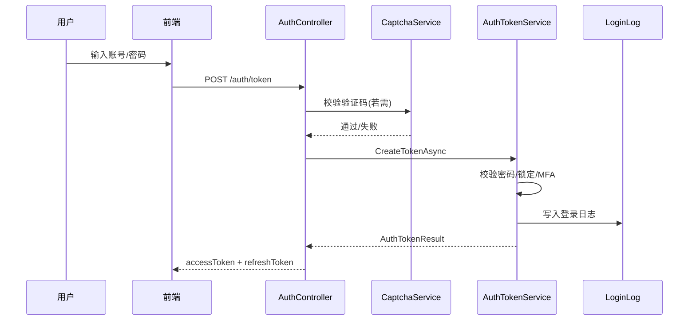
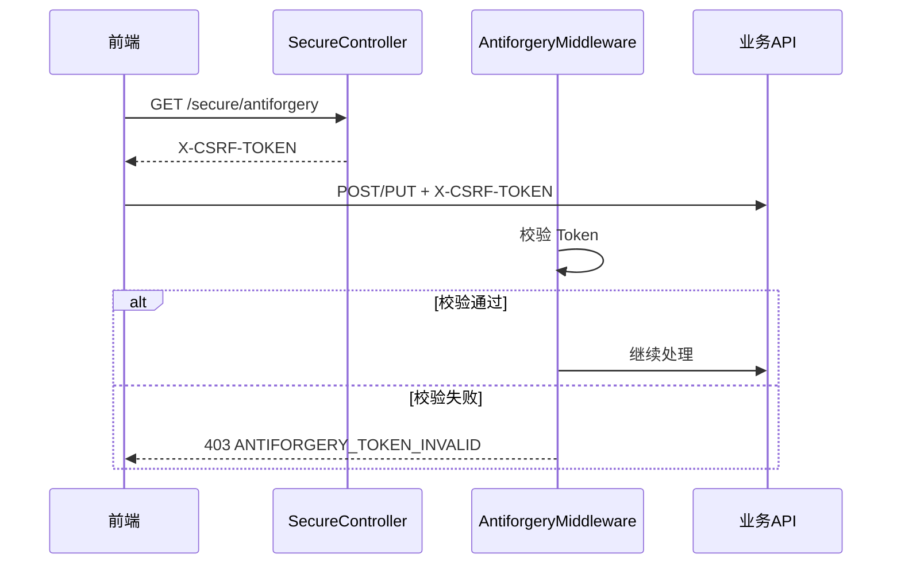

# PRD Case 01：用户认证安全基线闭环

## 1. 背景与目标

### 1.1 背景

Atlas Security Platform 需满足等保2.0三级身份鉴别与访问控制要求。认证安全是平台底座，所有业务能力依赖其正确性。

### 1.2 目标

实现 JWT 登录/刷新/登出、密码策略、MFA(TOTP)、账号锁定、CSRF/XSS 全链路可验收闭环，形成可审计证据链。

### 1.3 范围

| In Scope | Out Scope |
|----------|-----------|
| JWT 令牌颁发与刷新 | OAuth2/OIDC 第三方登录 |
| 密码策略（复杂度、过期、锁定） | 生物识别 |
| MFA(TOTP) 设置/验证/禁用 | 短信/邮箱验证码 |
| CSRF Token 获取与校验 | |
| XSS 输入净化（JSON Body/QueryString） | 富文本白名单（单独配置） |
| 登录日志 100% 写入 | |
| 在线会话查询与强制下线 | |
| 验证码（风控态） | |

---

## 2. 用户角色与权限矩阵

| 角色 | 登录/登出 | 刷新Token | 修改密码 | MFA设置 | 获取CSRF | 在线用户列表 | 强制下线 |
|------|-----------|-----------|----------|---------|----------|--------------|----------|
| 匿名 | ✓ | ✓ | - | - | - | - | - |
| 普通用户 | ✓ | ✓ | ✓ | ✓ | ✓ | - | - |
| 管理员 | ✓ | ✓ | ✓ | ✓ | ✓ | ✓ | ✓ |

---

## 3. 交互流程图

### 3.1 登录流程



### 3.2 写请求 CSRF 校验流程



---

## 4. 数据模型

### 4.1 核心实体

| 实体 | 关键字段 | 说明 |
|------|----------|------|
| UserAccount | Username, PasswordHash, MfaEnabled, MfaSecretKey, LockoutEnd, FailedAttempts | 用户账号 |
| AuthSession | UserId, TenantId, RefreshTokenHash, ExpiresAt, RevokedAt | 会话 |
| LoginLog | TenantId, Username, IpAddress, UserAgent, Success, CreatedAt | 登录日志 |
| PasswordHistory | UserId, PasswordHash, CreatedAt | 密码历史（90天防重用） |

### 4.2 配置项（appsettings.json）

```json
{
  "Security": {
    "PasswordPolicy": {
      "MinLength": 8,
      "RequireUppercase": true,
      "RequireLowercase": true,
      "RequireDigit": true,
      "RequireSpecialChar": true,
      "ExpirationDays": 90
    },
    "LockoutPolicy": {
      "MaxFailedAttempts": 5,
      "LockoutMinutes": 15
    },
    "CaptchaThreshold": 3
  },
  "Jwt": {
    "ExpiresMinutes": 30,
    "RefreshExpiresMinutes": 10080,
    "RememberMeRefreshExpiresMinutes": 43200
  },
  "Xss": {
    "WhitelistPaths": ["/api/v1/notifications"],
    "MaxBodySizeBytes": 1048576
  }
}
```

---

## 5. API 规范

### 5.1 认证相关

| 方法 | 路径 | 说明 | 幂等 | CSRF |
|------|------|------|------|------|
| GET | /api/v1/auth/captcha | 获取图形验证码 | - | - |
| POST | /api/v1/auth/token | 登录获取令牌 | - | - |
| POST | /api/v1/auth/refresh | 刷新令牌 | - | - |
| GET | /api/v1/auth/me | 获取当前用户信息 | - | - |
| PUT | /api/v1/auth/password | 修改密码 | ✓ | ✓ |
| POST | /api/v1/auth/logout | 登出 | ✓ | ✓ |

### 5.2 MFA 相关

| 方法 | 路径 | 说明 | 幂等 | CSRF |
|------|------|------|------|------|
| POST | /api/v1/mfa/setup | 发起 MFA 设置 | ✓ | ✓ |
| POST | /api/v1/mfa/verify-setup | 验证并启用 MFA | ✓ | ✓ |
| POST | /api/v1/mfa/disable | 禁用 MFA | ✓ | ✓ |
| GET | /api/v1/mfa/status | 查询 MFA 状态 | - | - |

### 5.3 安全相关

| 方法 | 路径 | 说明 | 幂等 | CSRF |
|------|------|------|------|------|
| GET | /api/v1/secure/antiforgery | 获取 CSRF Token | - | - |
| GET | /api/v1/secure/ping | 心跳（需登录） | - | - |

### 5.4 会话相关

| 方法 | 路径 | 说明 | 幂等 | CSRF |
|------|------|------|------|------|
| GET | /api/v1/sessions | 在线用户列表（分页） | - | - |
| DELETE | /api/v1/sessions/{sessionId} | 强制下线 | ✓ | ✓ |

### 5.5 请求头约定

- `Authorization: Bearer <accessToken>`：已登录请求必填
- `X-Tenant-Id: <guid>`：所有请求必填
- `Idempotency-Key: <uuid>`：写接口必填
- `X-CSRF-TOKEN: <token>`：已登录写请求必填

### 5.6 错误码

| 错误码 | 说明 |
|--------|------|
| INVALID_CREDENTIALS | 账号或密码错误 |
| ACCOUNT_LOCKED | 账号已锁定 |
| PASSWORD_EXPIRED | 密码已过期 |
| ANTIFORGERY_TOKEN_INVALID | CSRF 校验失败 |
| IDEMPOTENCY_REQUIRED | 缺少幂等键 |

---

## 6. 前端页面要素

### 6.1 登录页

- 租户/组织选择（a-select，支持搜索）
- 账号、密码输入框
- 验证码（风控态显示，120×40px 图形 + 换一张）
- 记住我复选框
- Caps Lock 提示条
- 错误提示条（顶部红条）

### 6.2 个人中心 / 安全设置

- 修改密码表单
- MFA 设置入口（启用/禁用）
- 当前会话列表（可选）

### 6.3 在线用户（管理员）

- 分页表格：用户名、IP、登录时间、客户端
- 强制下线按钮

---

## 7. 审计事件字典

| 事件类型 | 对象 | 关键字段 | 触发时机 |
|----------|------|----------|----------|
| LOGIN | UserAccount | tenant_id, username, ip, success | 登录成功/失败 |
| LOGOUT | AuthSession | tenant_id, user_id, session_id | 用户登出 |
| CHANGE_PASSWORD | UserAccount | tenant_id, user_id | 密码修改成功 |
| FORCE_LOGOUT | AuthSession | tenant_id, operator, target_session_id | 管理员强制下线 |
| MFA_SETUP | UserAccount | tenant_id, user_id | MFA 启用 |
| MFA_DISABLE | UserAccount | tenant_id, user_id | MFA 禁用 |

---

## 8. 验收标准

### 8.1 登录与令牌

- [ ] 正确账号密码可获取 accessToken + refreshToken
- [ ] 错误账号密码返回 INVALID_CREDENTIALS
- [ ] 连续失败 5 次触发账号锁定 15 分钟
- [ ] 密码过期返回 PASSWORD_EXPIRED
- [ ] 勾选"记住我"后 refreshToken 有效期 30 天
- [ ] 验证码错误时返回明确提示

### 8.2 MFA

- [ ] 可调用 setup 获取 SecretKey + ProvisioningUri
- [ ] 验证 TOTP 后 MFA 启用
- [ ] 禁用需提供当前 TOTP 码
- [ ] MFA 启用后登录需附带 TotpCode

### 8.3 CSRF

- [ ] GET /secure/antiforgery 返回 Token
- [ ] 写请求缺少 X-CSRF-TOKEN 返回 403
- [ ] 错误 Token 返回 ANTIFORGERY_TOKEN_INVALID

### 8.4 XSS

- [ ] POST/PUT/PATCH 且 application/json 时 Body 字符串被净化
- [ ] 白名单路径跳过净化
- [ ] 非 JSON 请求不进入 JSON 净化分支（修复括号 Bug）

### 8.5 登录日志

- [ ] 每次登录成功/失败写入 LoginLog
- [ ] 含 IP、UserAgent、Username、Success、CreatedAt

### 8.6 在线用户

- [ ] 管理员可查询在线用户列表

- [ ] 强制下线后该会话 Token 立即失效
- [ ] 强制下线写入审计

---

## 9. 等保映射

| 控制点 | 要求 | 平台实现 |
|--------|------|----------|
| 8.1.3 身份鉴别 | 用户身份唯一标识、鉴别信息复杂度 | 用户名唯一、密码策略、MFA |
| 8.1.3 | 登录失败处理、会话超时 | 锁定策略、Token 过期 |
| 8.1.3 | 多因素身份鉴别 | TOTP MFA |
| 8.1.4 访问控制 | 默认拒绝、最小权限 | RBAC、权限策略 |
| 8.1.5 安全审计 | 登录/登出/权限变更留痕 | 审计事件、LoginLog |
