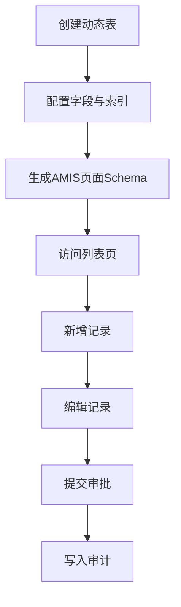

# PRD Case 02：动态表 CRUD 全链路闭环

## 1. 背景与目标

为实现低代码快速交付，平台需支持“建模即可用”：动态建表、自动生成页面、记录 CRUD、权限控制、审计留痕。

## 2. 用户角色与权限矩阵

| 角色 | 表管理 | 字段管理 | 记录查询 | 记录写入 | 删除 | 审批提交 |
|---|---|---|---|---|---|---|
| 系统管理员 | ✓ | ✓ | ✓ | ✓ | ✓ | ✓ |
| 应用管理员 | ✓ | ✓ | ✓ | ✓ | ✓ | ✓ |
| 普通用户 | - | - | 按授权 | 按授权 | 按授权 | 按授权 |

## 3. 交互流程图

## 4. 数据模型

| 实体 | 关键字段 | 说明 |
|---|---|---|
| DynamicTable | TableKey, TableName, DbType, ApprovalFlowId | 表定义 |
| DynamicField | FieldKey, FieldName, FieldType, IsRequired, IsUnique | 字段定义 |
| DynamicIndex | IndexName, Fields, IsUnique | 索引定义 |
| DynamicRecord | Id, TenantId, DataJson, Status | 记录数据 |

## 5. API 规范

| 方法 | 路径 | 说明 |
|---|---|---|
| GET | `/api/v1/dynamic-tables` | 动态表分页 |
| POST | `/api/v1/dynamic-tables` | 创建动态表（幂等+CSRF） |
| PUT | `/api/v1/dynamic-tables/{tableKey}` | 更新元数据（幂等+CSRF） |
| GET | `/api/v1/dynamic-tables/{tableKey}/fields` | 字段列表 |
| GET | `/api/v1/dynamic-tables/{tableKey}/records` | 记录分页 |
| POST | `/api/v1/dynamic-tables/{tableKey}/records` | 新增记录（幂等+CSRF） |
| PUT | `/api/v1/dynamic-tables/{tableKey}/records/{id}` | 更新记录（幂等+CSRF） |
| DELETE | `/api/v1/dynamic-tables/{tableKey}/records/{id}` | 删除记录（幂等+CSRF） |
| GET | `/api/v1/amis/dynamic-tables/{tableKey}/crud` | CRUD Schema |
| GET | `/api/v1/amis/dynamic-tables/{tableKey}/forms/create` | 新建表单 Schema |

请求头：`Authorization`、`X-Tenant-Id`、`Idempotency-Key`、`X-CSRF-TOKEN`。

## 6. 前端页面要素

- 动态表列表页：检索、分页、创建、编辑、删除。
- 表设计器：字段类型、必填、唯一、长度、默认值、索引配置。
- 记录 CRUD 页：列表筛选、排序、批量删除、详情抽屉。
- 表单页：创建/编辑共用 schema，字段联动和校验提示。

## 7. 审计事件字典

| 事件 | 对象 | 描述 |
|---|---|---|
| DYNAMIC_TABLE_CREATE | DynamicTable | 创建动态表 |
| DYNAMIC_TABLE_UPDATE | DynamicTable | 更新元数据 |
| DYNAMIC_TABLE_DELETE | DynamicTable | 删除动态表 |
| DYNAMIC_RECORD_CREATE | DynamicRecord | 新增记录 |
| DYNAMIC_RECORD_UPDATE | DynamicRecord | 更新记录 |
| DYNAMIC_RECORD_DELETE | DynamicRecord | 删除记录 |
| DYNAMIC_RECORD_SUBMIT_APPROVAL | DynamicRecord | 提交审批 |

## 8. 验收标准

- [ ] 动态表可创建并返回唯一 `tableKey`。
- [ ] 字段校验（必填/唯一/长度）生效。
- [ ] AMIS Schema 可渲染列表页和表单页。
- [ ] 记录 CRUD、分页、排序、筛选正常。
- [ ] 所有写接口均校验幂等键与 CSRF。
- [ ] 跨租户访问被拒绝。
- [ ] 全部关键操作可在审计日志检索。

## 9. 等保映射

| 控制点 | 对应能力 |
|---|---|
| 8.1.4 访问控制 | RBAC + 接口权限策略 |
| 8.1.5 安全审计 | 动态表与记录操作留痕 |
| 8.1.3 输入校验 | 字段规则 + 接口验证 |
