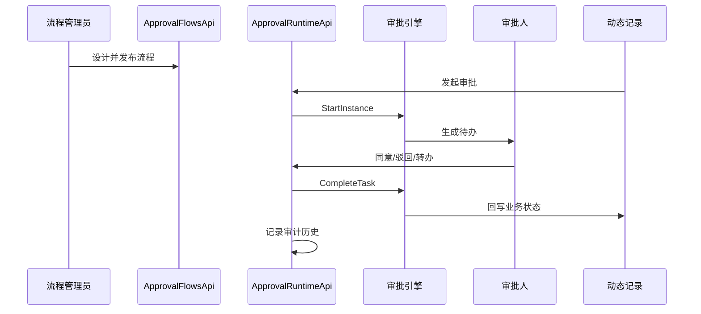

# PRD Case 03：审批流设计与运行闭环

## 1. 背景与目标

审批流是等保场景下整改、变更、发布、工单的核心控制链路。目标是完成“设计-发布-发起-审批-回写-审计”最小闭环。

## 2. 用户角色与权限矩阵

| 角色 | 流程设计 | 流程发布 | 发起审批 | 审批处理 | 查看全量历史 |
|---|---|---|---|---|---|
| 流程管理员 | ✓ | ✓ | - | - | ✓ |
| 业务用户 | - | - | ✓ | - | 本人相关 |
| 审批人 | - | - | - | ✓ | 本人相关 |
| 审计员 | - | - | - | - | ✓ |

## 3. 交互流程图

## 4. 数据模型

| 实体 | 关键字段 | 说明 |
|---|---|---|
| ApprovalFlowDefinition | FlowCode, Name, Version, Status | 流程定义 |
| ApprovalInstance | BusinessType, BusinessId, Status, CurrentNode | 流程实例 |
| ApprovalTask | InstanceId, AssigneeId, Status, DueAt | 审批任务 |
| ApprovalHistory | InstanceId, Action, Comment, Operator | 操作历史 |
| ApprovalCopyRecord | InstanceId, UserId, ReadAt | 抄送记录 |

## 5. API 规范

| 方法 | 路径 | 说明 |
|---|---|---|
| GET | `/api/v1/approval/flows` | 流程定义列表 |
| POST | `/api/v1/approval/flows` | 新建流程定义 |
| POST | `/api/v1/approval/flows/{id}/publish` | 发布流程 |
| POST | `/api/v1/dynamic-tables/{tableKey}/records/{id}/approval` | 从动态记录发起审批 |
| GET | `/api/v1/approval/tasks` | 我的待办 |
| POST | `/api/v1/approval/tasks/{taskId}/approve` | 同意 |
| POST | `/api/v1/approval/tasks/{taskId}/reject` | 驳回 |
| POST | `/api/v1/approval/tasks/{taskId}/transfer` | 转办 |

写操作必须携带 `Idempotency-Key` 与 `X-CSRF-TOKEN`。

## 6. 前端页面要素

- 流程设计器：节点拖拽、条件配置、分支校验、发布按钮。
- 待办中心：待办/已办/我发起/抄送，支持批量操作。
- 记录详情页：审批状态标签、历史时间线、审批操作区。
- 流程管理页：版本、发布状态、禁用/启用。

## 7. 审计事件字典

| 事件 | 对象 | 描述 |
|---|---|---|
| APPROVAL_FLOW_PUBLISH | FlowDefinition | 发布流程 |
| APPROVAL_INSTANCE_START | ApprovalInstance | 发起审批 |
| APPROVAL_TASK_APPROVE | ApprovalTask | 审批通过 |
| APPROVAL_TASK_REJECT | ApprovalTask | 审批驳回 |
| APPROVAL_TASK_TRANSFER | ApprovalTask | 任务转办 |
| APPROVAL_INSTANCE_FINISH | ApprovalInstance | 流程完成 |

## 8. 验收标准

- [ ] 至少一个流程定义可成功发布。
- [ ] 动态表记录可发起审批并创建实例。
- [ ] 审批人可执行同意/驳回且状态正确流转。
- [ ] 审批历史时间线完整可追溯。
- [ ] 越权审批请求被拒绝。
- [ ] 项目域与租户隔离生效。
- [ ] 全链路审计可导出。

## 9. 等保映射

| 控制点 | 对应能力 |
|---|---|
| 8.1.4 访问控制 | 审批任务按角色/人员授权 |
| 8.1.5 安全审计 | 流程定义与任务操作全留痕 |
| 8.1.7 安全管理 | 关键变更通过流程审批闭环 |
