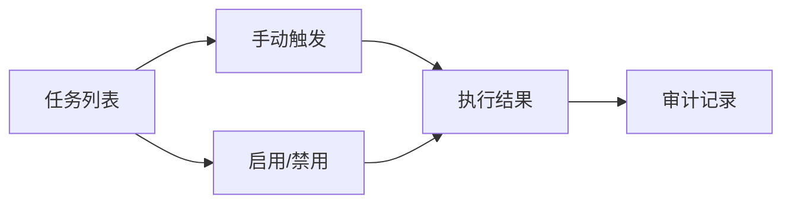

# PRD Case 04：定时任务管理闭环

## 1. 背景与目标

平台需要统一管理后台定时任务（巡检、清理、同步、提醒），确保任务可见、可控、可追溯，满足生产运维与合规要求。

## 2. 用户角色与权限矩阵

| 角色 | 查看任务 | 手动触发 | 启用/禁用 | 查看历史 | 审计导出 |
|---|---|---|---|---|---|
| 运维管理员 | ✓ | ✓ | ✓ | ✓ | ✓ |
| 审计员 | ✓ | - | - | ✓ | ✓ |
| 普通用户 | - | - | - | - | - |

## 3. 交互流程图

## 4. 数据模型

| 实体/模型 | 关键字段 | 说明 |
|---|---|---|
| ScheduledJobDto | JobId, Cron, Enabled, LastRunAt, NextRunAt | 任务展示模型 |
| Hangfire Job | RecurringJobId, Queue, LastExecution, Error | Hangfire 存储记录 |
| AuditLog | Action, Target, Actor, Result, CreatedAt | 操作审计 |

## 5. API 规范

| 方法 | 路径 | 说明 |
|---|---|---|
| GET | `/api/v1/scheduled-jobs` | 分页查询任务 |
| POST | `/api/v1/scheduled-jobs/{jobId}/trigger` | 手动触发 |
| PUT | `/api/v1/scheduled-jobs/{jobId}/enable` | 启用任务 |
| PUT | `/api/v1/scheduled-jobs/{jobId}/disable` | 禁用任务 |

写接口要求：`Authorization`、`X-Tenant-Id`、`Idempotency-Key`、`X-CSRF-TOKEN`。

## 6. 前端页面要素

- 任务列表：任务标识、CRON、状态、最近执行、下次执行。
- 操作按钮：立即触发、启用、禁用。
- 执行历史：成功/失败状态、错误信息、耗时。
- 搜索过滤：按状态、任务名、时间范围筛选。

## 7. 审计事件字典

| 事件 | 对象 | 描述 |
|---|---|---|
| TRIGGER_JOB | ScheduledJob | 手动触发任务 |
| ENABLE_JOB | ScheduledJob | 启用任务 |
| DISABLE_JOB | ScheduledJob | 禁用任务 |

## 8. 验收标准

- [ ] 任务列表可分页展示，数据与 Hangfire 一致。
- [ ] 手动触发后任务进入执行队列。
- [ ] 启用/禁用操作即时生效。
- [ ] 执行失败可查看错误原因。
- [ ] 所有操作写入审计日志并可查询。
- [ ] 未授权用户访问返回 403。

## 9. 等保映射

| 控制点 | 对应能力 |
|---|---|
| 8.1.5 安全审计 | 关键运维操作审计留痕 |
| 8.1.7 安全管理中心 | 运维作业统一管理 |
| 8.1.8 可用性保障 | 周期任务保障系统稳定运行 |
