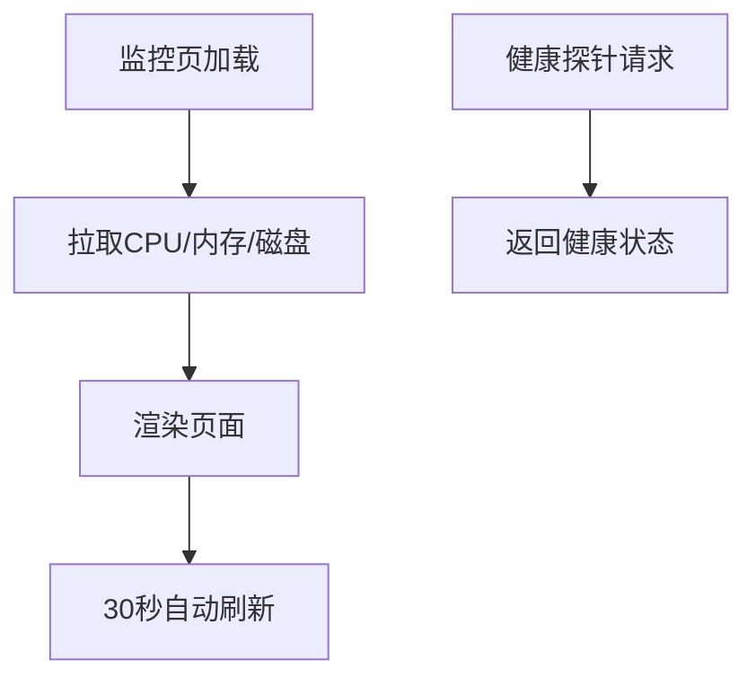

# PRD Case 05：服务监控与健康检查闭环

## 1. 背景与目标

生产环境需要可观测性基础能力，为运维、值班与等保测评提供统一监控入口与健康证明。

## 2. 用户角色与权限矩阵

| 角色 | 监控概览 | 健康检查 | 敏感字段查看 | 告警确认 |
|---|---|---|---|---|
| 运维管理员 | ✓ | ✓ | ✓ | ✓ |
| 审计员 | ✓ | ✓ | 脱敏 | - |
| 普通用户 | - | - | - | - |

## 3. 交互流程图

## 4. 数据模型

| 模型 | 字段 | 说明 |
|---|---|---|
| ServerInfoDto | Cpu, MemoryUsed, MemoryTotal, DiskUsed, DotNetVersion, Uptime | 运行信息 |
| HealthResult | Status, Checks, Duration | 健康状态 |
| AlertEvent | Name, Severity, Threshold, TriggerAt | 告警事件 |

## 5. API 规范

| 方法 | 路径 | 说明 |
|---|---|---|
| GET | `/api/v1/monitor/server` | 服务器监控信息 |
| GET | `/health` | 健康检查探针 |

## 6. 前端页面要素

- 概览卡片：CPU、内存、磁盘、运行时版本、启动时长。
- 刷新策略：默认 30 秒轮询，可手动刷新。
- 权限控制：仅 Admin 可见完整机器信息，其他角色脱敏显示。
- 异常提示：超过阈值显示告警标记。

## 7. 审计事件字典

| 事件 | 对象 | 描述 |
|---|---|---|
| MONITOR_VIEW | ServerInfo | 查看监控页 |
| HEALTH_PROBE | HealthEndpoint | 健康探针访问 |

## 8. 验收标准

- [ ] 页面展示 CPU 核心数、内存、磁盘、.NET 版本、启动时间。
- [ ] 默认 30 秒自动刷新且可手动刷新。
- [ ] 非管理员访问监控页被拒绝。
- [ ] 健康探针输出标准健康状态。
- [ ] 敏感字段仅管理员可见。

## 9. 等保映射

| 控制点 | 对应能力 |
|---|---|
| 8.1.6 运行安全 | 关键资源状态实时监控 |
| 8.1.8 可用性 | 健康检查与故障快速定位 |
| 8.1.5 审计要求 | 监控访问与异常处理留痕 |
