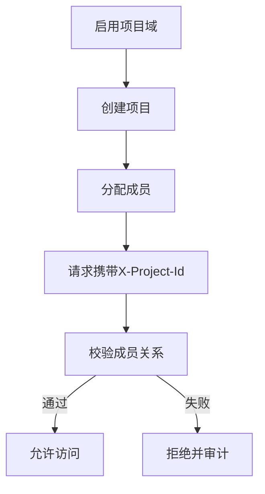

# PRD Case 06：项目域权限隔离闭环

## 1. 背景与目标

同一应用下存在多项目并行运行，必须做到项目级成员隔离，防止跨项目越权访问。

## 2. 用户角色与权限矩阵

| 角色 | 创建项目 | 分配成员 | 项目内访问 | 跨项目访问 |
|---|---|---|---|---|
| 应用管理员 | ✓ | ✓ | ✓ | 仅授权项目 |
| 项目成员 | - | - | ✓ | - |
| 普通用户 | - | - | - | - |

## 3. 交互流程图

## 4. 数据模型

| 实体 | 关键字段 | 说明 |
|---|---|---|
| Project | Id, AppId, Name, Status | 项目定义 |
| ProjectUser | ProjectId, UserId, Role | 项目成员 |
| ProjectDepartment | ProjectId, DepartmentId | 部门授权 |
| ProjectPosition | ProjectId, PositionId | 岗位授权 |

## 5. API 规范

| 方法 | 路径 | 说明 |
|---|---|---|
| GET | `/api/v1/projects` | 项目列表 |
| POST | `/api/v1/projects` | 创建项目 |
| PUT | `/api/v1/projects/{id}` | 更新项目 |
| POST | `/api/v1/projects/{id}/members` | 分配成员 |
| DELETE | `/api/v1/projects/{id}/members/{userId}` | 移除成员 |

请求约束：
- 启用项目域时，业务接口必须传 `X-Project-Id`。
- `X-Project-Id` 与当前用户成员关系不匹配返回 403。

## 6. 前端页面要素

- 项目管理页：项目创建、状态启停、成员维护。
- 顶栏项目切换器：显示当前项目，支持快速切换。
- 越权提示：跨项目访问时给出明确错误提示。

## 7. 审计事件字典

| 事件 | 对象 | 描述 |
|---|---|---|
| PROJECT_CREATE | Project | 创建项目 |
| PROJECT_MEMBER_ADD | ProjectUser | 分配成员 |
| PROJECT_MEMBER_REMOVE | ProjectUser | 移除成员 |
| PROJECT_ACCESS_DENIED | ProjectScope | 跨项目访问拒绝 |

## 8. 验收标准

- [ ] 启用项目域后，未携带 `X-Project-Id` 的请求被拒绝。
- [ ] 非成员访问项目资源返回 403。
- [ ] 成员仅可访问被授权项目数据。
- [ ] 关闭项目域时，接口忽略项目头并按应用级访问。
- [ ] 跨项目拒绝行为可审计。

## 9. 等保映射

| 控制点 | 对应能力 |
|---|---|
| 8.1.4 访问控制 | 项目级最小权限隔离 |
| 8.1.5 安全审计 | 越权访问与成员变更留痕 |
| 8.1.3 身份鉴别 | 请求上下文强校验（租户+项目） |
