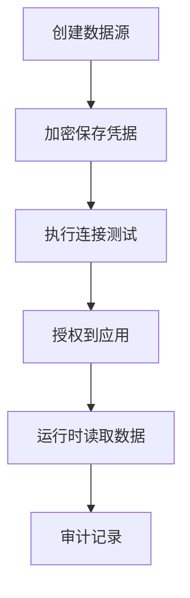

# PRD Case 07：多数据源接入闭环

## 1. 背景与目标

平台需支持租户级外部数据源接入，并保证凭据安全、连接可验证、授权可控、行为可审计。

## 2. 用户角色与权限矩阵

| 角色 | 新建数据源 | 编辑/禁用 | 连接测试 | 授权应用 | 查看凭据明文 |
|---|---|---|---|---|---|
| 平台管理员 | ✓ | ✓ | ✓ | ✓ | - |
| 应用管理员 | - | - | 可用已授权 | - | - |
| 审计员 | 查看 | - | - | - | - |

## 3. 交互流程图

## 4. 数据模型

| 实体 | 关键字段 | 说明 |
|---|---|---|
| TenantDataSource | Id, TenantId, Name, Type, ConnectionStringCipher, Status | 数据源主表 |
| DataSourceGrant | DataSourceId, AppId, ProjectId | 授权关系 |
| DataSourceTestLog | DataSourceId, Success, LatencyMs, ErrorMessage | 测试日志 |

## 5. API 规范

| 方法 | 路径 | 说明 |
|---|---|---|
| GET | `/api/v1/tenant-data-sources` | 数据源列表 |
| POST | `/api/v1/tenant-data-sources` | 新建数据源 |
| PUT | `/api/v1/tenant-data-sources/{id}` | 更新数据源 |
| POST | `/api/v1/tenant-data-sources/{id}/test` | 连接测试 |
| POST | `/api/v1/tenant-data-sources/{id}/grant` | 授权应用/项目 |
| PUT | `/api/v1/tenant-data-sources/{id}/disable` | 禁用数据源 |

写接口必须携带 `Idempotency-Key`、`X-CSRF-TOKEN`。

## 6. 前端页面要素

- 数据源列表：类型、状态、最近测试结果、授权范围。
- 新建/编辑弹窗：连接参数、连接池参数、超时、加密开关。
- 连接测试结果面板：延迟、错误原因、建议修复。
- 授权面板：按应用/项目粒度授权。

## 7. 审计事件字典

| 事件 | 对象 | 描述 |
|---|---|---|
| DATASOURCE_CREATE | TenantDataSource | 创建数据源 |
| DATASOURCE_UPDATE | TenantDataSource | 更新数据源 |
| DATASOURCE_TEST | TenantDataSource | 连接测试 |
| DATASOURCE_GRANT | DataSourceGrant | 授权变更 |
| DATASOURCE_DISABLE | TenantDataSource | 禁用数据源 |

## 8. 验收标准

- [ ] 支持至少 1 种外部数据库接入并测试成功。
- [ ] 连接串以密文存储，接口返回脱敏值。
- [ ] 测试接口返回延迟与错误细节。
- [ ] 未授权应用无法使用该数据源。
- [ ] 所有管理操作可审计。

## 9. 等保映射

| 控制点 | 对应能力 |
|---|---|
| 8.1.4 访问控制 | 数据源按租户与应用授权 |
| 8.1.5 审计要求 | 数据源配置与测试留痕 |
| 8.1.6 数据安全 | 凭据加密存储与脱敏展示 |
