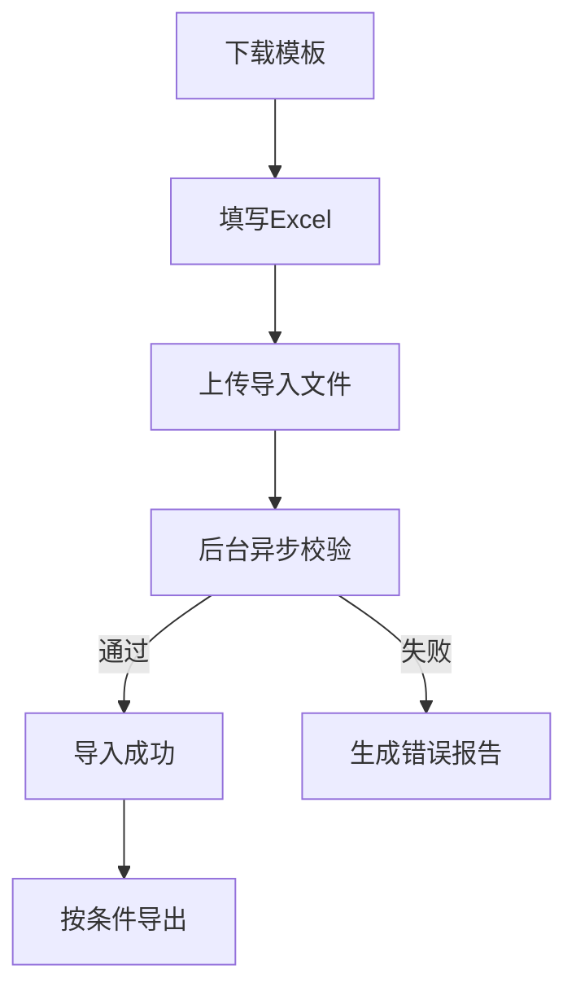

# PRD Case 09：Excel 导入导出闭环

## 1. 背景与目标

批量数据处理是管理平台高频需求。目标是实现模板下载、批量导入、错误行反馈、导出文件全链路闭环，并满足审计与权限控制。

## 2. 用户角色与权限矩阵

| 角色 | 下载模板 | 导入 | 导出 | 查看导入任务 |
|---|---|---|---|---|
| 应用管理员 | ✓ | ✓ | ✓ | ✓ |
| 业务用户 | 按授权 | 按授权 | 按授权 | 本人任务 |
| 审计员 | - | - | - | 查看审计 |

## 3. 交互流程图

## 4. 数据模型

| 实体 | 关键字段 | 说明 |
|---|---|---|
| ImportJob | Id, Target, Status, TotalRows, SuccessRows, FailedRows | 导入任务 |
| ImportErrorRow | JobId, RowNumber, ColumnName, ErrorCode, Message | 错误明细 |
| ExportJob | Id, Target, FilterJson, FileId, Status | 导出任务 |

## 5. API 规范

| 方法 | 路径 | 说明 |
|---|---|---|
| GET | `/api/v1/excel/templates/{target}` | 下载模板 |
| POST | `/api/v1/excel/import/{target}` | 上传并发起导入 |
| GET | `/api/v1/excel/import-jobs/{jobId}` | 导入进度 |
| GET | `/api/v1/excel/import-jobs/{jobId}/errors` | 错误报告 |
| POST | `/api/v1/excel/export/{target}` | 发起导出 |
| GET | `/api/v1/excel/export-jobs/{jobId}/download` | 下载导出文件 |

实现建议：采用后台作业（Hangfire）处理大文件任务。

## 6. 前端页面要素

- 导入向导：下载模板、上传文件、进度条、错误反馈。
- 导入结果页：成功/失败数量、错误行下载。
- 导出面板：筛选条件、文件格式、任务状态。
- 历史任务页：导入/导出任务列表与重试。

## 7. 审计事件字典

| 事件 | 对象 | 描述 |
|---|---|---|
| EXCEL_TEMPLATE_DOWNLOAD | Template | 下载模板 |
| EXCEL_IMPORT_START | ImportJob | 发起导入 |
| EXCEL_IMPORT_FINISH | ImportJob | 导入完成 |
| EXCEL_EXPORT_START | ExportJob | 发起导出 |
| EXCEL_EXPORT_DOWNLOAD | ExportFile | 下载导出文件 |

## 8. 验收标准

- [ ] 用户可下载标准模板并成功导入。
- [ ] 导入失败能定位到具体行列和错误原因。
- [ ] 导入/导出任务支持异步执行与进度查询。
- [ ] 导出文件受权限控制，不可越权下载。
- [ ] 导入导出操作全量审计。

## 9. 等保映射

| 控制点 | 对应能力 |
|---|---|
| 8.1.3 输入校验 | 导入数据强校验与错误反馈 |
| 8.1.4 访问控制 | 导出数据权限校验 |
| 8.1.5 审计要求 | 导入导出全流程审计 |
