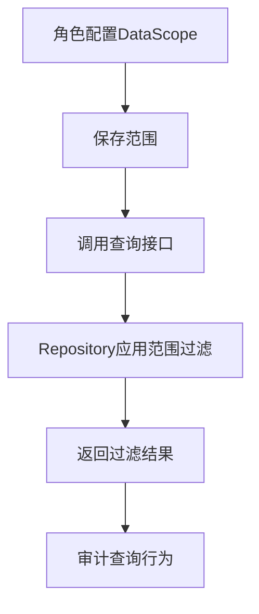

# PRD Case 10：数据权限 DataScope 闭环

## 1. 背景与目标

角色级数据权限是平台横向权限模型关键能力。目标是基于角色配置自动过滤查询结果，实现“同功能不同数据可见范围”。

## 2. 用户角色与权限矩阵

| 角色 | 配置范围 | 查看本部门 | 查看本人 | 查看全部 | 自定义部门 |
|---|---|---|---|---|---|
| 超级管理员 | ✓ | ✓ | ✓ | ✓ | ✓ |
| 角色管理员 | ✓ | ✓ | ✓ | - | ✓ |
| 普通用户 | - | 按角色 | 按角色 | - | 按角色 |

数据范围枚举建议：`ALL`、`DEPT_AND_SUB`、`DEPT`、`SELF`、`CUSTOM`。

## 3. 交互流程图

## 4. 数据模型

| 实体 | 关键字段 | 说明 |
|---|---|---|
| Role | Id, Name, DataScope | 角色数据范围 |
| RoleDataScopeDept | RoleId, DeptId | 自定义部门映射 |
| UserRole | UserId, RoleId | 用户角色关系 |

## 5. API 规范

| 方法 | 路径 | 说明 |
|---|---|---|
| GET | `/api/v1/roles/{id}` | 查询角色详情（含 DataScope） |
| PUT | `/api/v1/roles/{id}/data-scope` | 更新角色数据范围 |
| GET | `/api/v1/users` | 用户查询（自动套用 DataScope） |
| GET | `/api/v1/audit/logs` | 审计查询（自动套用 DataScope） |

实现建议：
- 在 Repository 查询入口统一注入 DataScope 过滤器。
- 禁止控制器层手写散落过滤逻辑，保证一致性。

## 6. 前端页面要素

- 角色管理页新增“数据权限”Tab。
- 范围选择：全部、本部门及以下、本部门、仅本人、自定义。
- 自定义部门选择器：支持远程检索和多选。
- 权限预览：显示当前角色可见范围说明。

## 7. 审计事件字典

| 事件 | 对象 | 描述 |
|---|---|---|
| ROLE_DATA_SCOPE_UPDATE | Role | 更新角色数据范围 |
| DATA_SCOPE_QUERY_APPLIED | Query | 查询应用数据范围过滤 |

## 8. 验收标准

- [ ] 五种 DataScope 配置均可保存并生效。
- [ ] 用户查询按角色范围自动过滤。
- [ ] 审计查询按角色范围自动过滤。
- [ ] 超级管理员可查看全部数据。
- [ ] 角色数据范围变更可审计追踪。

## 9. 等保映射

| 控制点 | 对应能力 |
|---|---|
| 8.1.4 访问控制 | 数据级最小权限控制 |
| 8.1.5 安全审计 | 权限变更与查询行为留痕 |
