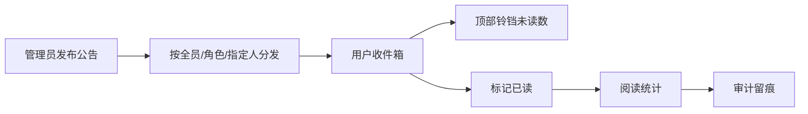

# PRD Case 11：通知公告完整闭环

## 1. 背景与目标

通知公告是系统内消息触达与流程提醒核心能力。目标是实现“发布-分发-阅读-统计-审计”完整闭环。

## 2. 用户角色与权限矩阵

| 角色 | 发布公告 | 编辑/删除 | 查看收件箱 | 标记已读 | 查看全量统计 |
|---|---|---|---|---|---|
| 管理员 | ✓ | ✓ | ✓ | ✓ | ✓ |
| 普通用户 | - | - | ✓ | ✓ | - |
| 审计员 | - | - | - | - | ✓ |

## 3. 交互流程图

## 4. 数据模型

| 实体 | 关键字段 | 说明 |
|---|---|---|
| Notification | Id, Title, Content, PublishAt, Status | 公告主表 |
| UserNotification | NotificationId, UserId, IsRead, ReadAt | 用户收件 |
| NotificationTarget | NotificationId, TargetType, TargetId | 接收范围 |

## 5. API 规范

| 方法 | 路径 | 说明 |
|---|---|---|
| GET | `/api/v1/notifications` | 公告列表 |
| POST | `/api/v1/notifications` | 发布公告 |
| PUT | `/api/v1/notifications/{id}` | 编辑公告 |
| DELETE | `/api/v1/notifications/{id}` | 删除公告 |
| GET | `/api/v1/notifications/inbox` | 我的收件箱 |
| PUT | `/api/v1/notifications/{id}/read` | 标记已读 |
| GET | `/api/v1/notifications/unread-count` | 未读数量 |

富文本内容需经过 XSS 净化；写接口要求幂等与 CSRF。

## 6. 前端页面要素

- 公告管理页：发布范围、发布时间、状态管理。
- 收件箱页：未读/已读切换、详情抽屉、批量已读。
- 顶栏铃铛：未读角标，点击跳转收件箱。
- 富文本编辑器：基础格式、链接、图片（可选）。

## 7. 审计事件字典

| 事件 | 对象 | 描述 |
|---|---|---|
| NOTIFICATION_PUBLISH | Notification | 发布公告 |
| NOTIFICATION_UPDATE | Notification | 编辑公告 |
| NOTIFICATION_DELETE | Notification | 删除公告 |
| NOTIFICATION_READ | UserNotification | 用户已读 |

## 8. 验收标准

- [ ] 管理员可按全员/角色/指定人发布公告。
- [ ] 用户可在收件箱查看并标记已读。
- [ ] 顶栏铃铛正确显示未读数量。
- [ ] 富文本内容渲染安全，无 XSS 注入。
- [ ] 发布与阅读行为可审计追踪。

## 9. 等保映射

| 控制点 | 对应能力 |
|---|---|
| 8.1.5 安全审计 | 通知发布与阅读留痕 |
| 8.1.4 访问控制 | 公告接收范围按角色/用户控制 |
| 8.1.3 输入安全 | 富文本内容净化防护 |
