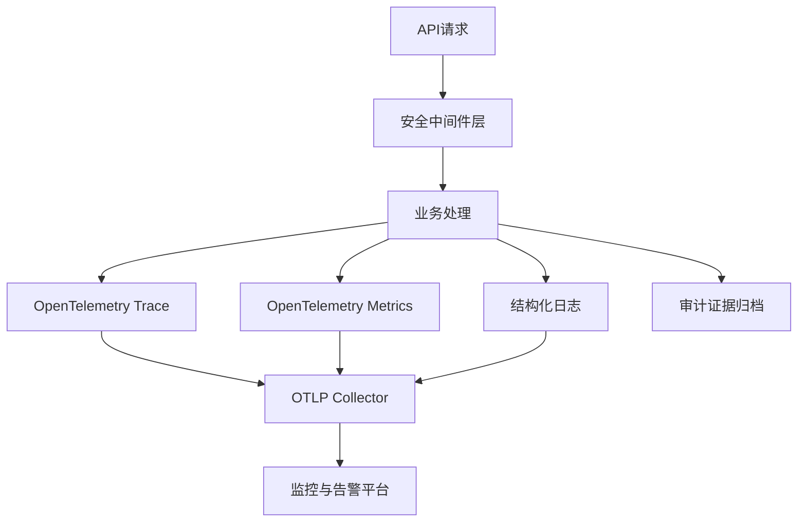

# PRD Case 12：生产级安全与可观测性加固

## 1. 背景与目标

为达到生产级交付标准，需要对安全中间件、可观测性、合规证据和灾备能力进行专项加固。

## 2. 范围与里程碑

### 2.1 范围

1. 安全修复：修复 `XssProtectionMiddleware` 条件优先级问题，补齐白名单配置能力。  
2. 可观测性：接入 OpenTelemetry（Trace/Metrics/Logs）。  
3. 合规证据：建立等保控制点到实现证据映射文档。  
4. 灾备演练：固化备份恢复流程，明确 RPO/RTO 目标。

### 2.2 里程碑

- M1：完成 XSS 修复与回归。
- M2：完成 OpenTelemetry 接入并可观测。
- M3：完成等保证据映射文档。
- M4：完成备份恢复演练并出报告。

## 3. 交互/架构流程图

## 4. 技术实施清单

### 4.1 安全修复

- 修复 JSON Body 净化条件为：`IsJsonContentType && (POST || PUT || PATCH)`。
- 新增白名单路径配置及测试用例。
- 回归验证：非 JSON 请求不进入 JSON 净化逻辑。

### 4.2 OpenTelemetry

- 引入包：`OpenTelemetry.Extensions.Hosting`、`OpenTelemetry.Instrumentation.AspNetCore`、`OpenTelemetry.Instrumentation.Http`。
- 采集指标：
  - API 请求量、错误率、P95/P99 延迟；
  - 审批任务积压；
  - 定时任务延迟与失败率。
- 导出目标：OTLP（推荐）或本地文件（开发环境）。

### 4.3 等保证据链

产出 `docs/compliance-evidence-map.md`，至少包含：
- 控制点编号；
- 平台实现能力；
- 代码/配置位置；
- 日志和审计记录位置；
- 导出方式与责任人。

### 4.4 备份与恢复演练

- 验证自动备份任务正常写入 `backups/`。
- 制定恢复步骤：停止服务、恢复数据库、校验完整性、重启服务。
- 目标：`RPO <= 24h`，`RTO <= 2h`。

## 5. API/运维接口约定

| 类型 | 项目 | 说明 |
|---|---|---|
| 健康探针 | `/health` | 提供系统可用性判断 |
| 指标暴露 | `/metrics` 或 OTLP | 监控系统采集 |
| 审计导出 | 审计查询接口 | 合规留档 |

## 6. 审计事件字典

| 事件 | 对象 | 描述 |
|---|---|---|
| SECURITY_MIDDLEWARE_UPDATE | Middleware | 安全中间件变更 |
| OBSERVABILITY_ENABLED | Runtime | 观测能力启用 |
| BACKUP_RECOVERY_DRILL | Database | 备份恢复演练 |
| COMPLIANCE_EVIDENCE_EXPORT | Compliance | 合规证据导出 |

## 7. 验收标准

- [ ] XSS 中间件逻辑修复完成并通过回归测试。
- [ ] OpenTelemetry 指标、链路、日志可被采集与查询。
- [ ] 核心 SLO（请求成功率、P95 延迟）可观测。
- [ ] 等保证据链文档可用于测评抽检。
- [ ] 备份恢复演练成功并记录 RPO/RTO。

## 8. 等保映射

| 控制点 | 对应能力 |
|---|---|
| 8.1.3 输入安全 | XSS 防护与输入净化 |
| 8.1.5 安全审计 | 审计日志与证据导出 |
| 8.1.6 运行安全 | 实时监控与告警 |
| 8.1.8 备份恢复 | 备份策略与恢复演练 |
