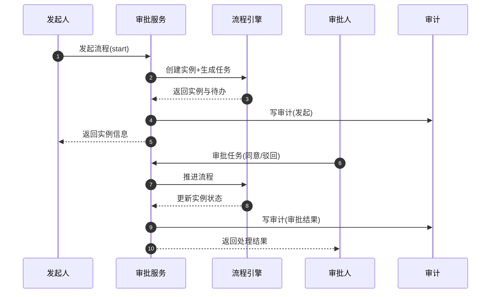
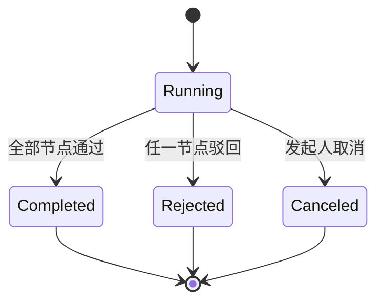
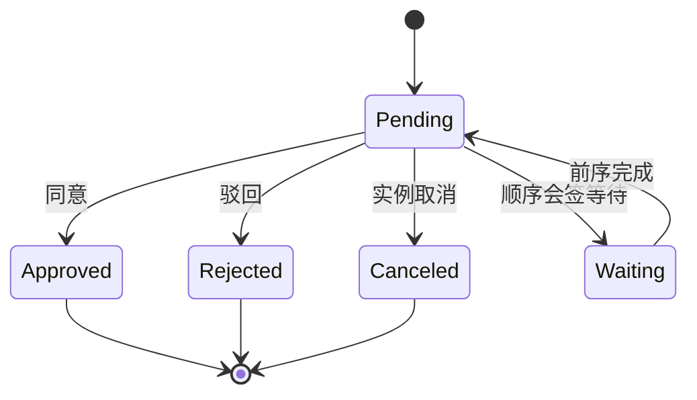

# 审批流功能说明

## 目标与范围

- 支持跨业务场景的统一审批能力。
- 以多租户为边界进行权限与数据隔离。
- 审批节点与操作类型与 AntFlow.net 语义对齐。

## 流程定义管理

### 能力概述

- 创建、更新、发布、禁用与删除流程定义。
- 按状态与关键字分页查询。

### 主要接口

- `GET /api/approval/flows`：分页查询流程定义。
- `GET /api/approval/flows/{id}`：流程定义详情。
- `POST /api/approval/flows`：创建流程定义（Admin）。
- `PUT /api/approval/flows/{id}`：更新流程定义（Admin）。
- `POST /api/approval/flows/{id}/publish`：发布（Admin）。
- `POST /api/approval/flows/{id}/disable`：禁用（Admin）。
- `DELETE /api/approval/flows/{id}`：删除（Admin）。

### 状态枚举

- Draft（草稿）
- Published（已发布）
- Disabled（已停用）

## 运行时与实例

### 能力概述

- 发起流程、查询实例、查看历史、取消实例。
- 支持预览与打印，并记录审计日志。
- 运行时操作包含撤回、转办、加签、打回修改、退回任意节点、撤销同意等。

### 主要接口

- `POST /api/approval/runtime/start`：发起流程实例。
- `GET /api/approval/runtime/my-instances`：我的发起列表。
- `GET /api/approval/runtime/instances/{id}`：实例详情。
- `GET /api/approval/runtime/instances/{id}/history`：实例历史事件。
- `POST /api/approval/runtime/instances/{id}/cancel`：取消实例。
- `POST /api/approval/runtime/instances/{id}/operations`：运行时操作。
- `GET /api/approval/runtime/instances/{id}/preview`：预览实例。
- `GET /api/approval/runtime/instances/{id}/print`：打印实例。

### 实例状态

- Running（运行中）
- Completed（已完成）
- Rejected（已驳回）
- Canceled（已取消）

## 任务处理

### 能力概述

- 我的待办任务查询。
- 审批任务同意/驳回。
- 支持实例维度的任务查询。

### 主要接口

- `GET /api/approval/tasks/my-tasks`：我的待办。
- `GET /api/approval/tasks/by-instance/{instanceId}`：实例内任务。
- `POST /api/approval/tasks/{taskId}/approve`：同意任务。
- `POST /api/approval/tasks/{taskId}/reject`：驳回任务。

### 任务状态

- Pending（待审批）
- Approved（已同意）
- Rejected（已驳回）
- Canceled（已取消）
- Waiting（等待激活）

## 抄送与已读

- `GET /api/approval/copy-records/my-copies`：我的抄送记录。
- `POST /api/approval/copy-records/{copyRecordId}/mark-read`：标记已读。

## 部门负责人

- `POST /api/approval/department-leaders`：设置部门负责人（Admin）。
- `GET /api/approval/department-leaders/{departmentId}`：查询负责人（Admin）。
- `DELETE /api/approval/department-leaders/{departmentId}`：移除负责人（Admin）。

## 节点与审批人策略

### 节点类型

- Start、Approve、Condition、End。
- ExclusiveGateway（XOR）、ParallelGateway（AND）。
- Copy、ExternalCondition。

### 审批人策略

- 指定用户、角色、部门负责人。
- 层层审批、指定层级、直属领导、发起人。
- HRBP、自选审批人、业务表取人、外部传入。

### 审批模式

- All（会签全部通过）
- Any（或签任一通过）
- Sequential（顺序会签）

## 审计与合规

- 发起、同意、驳回、取消、运行时操作、预览、打印均记录审计日志。
- 审批实例的预览与打印进行权限校验。

## 典型业务示例

### 请假审批流程（示例）

节点结构：

- 开始节点
- 部门负责人审批
- 人力审批
- 结束节点

示例定义（节选）：

```json
{
  "nodes": [
    { "id": "start", "type": "start", "data": { "label": "开始" } },
    { "id": "approve1", "type": "approve", "data": { "label": "部门负责人审批", "assigneeType": "DepartmentLeader", "assigneeValue": "1" } },
    { "id": "approve2", "type": "approve", "data": { "label": "人力审批", "assigneeType": "Role", "assigneeValue": "HR" } },
    { "id": "end", "type": "end", "data": { "label": "结束" } }
  ],
  "edges": [
    { "id": "e1", "source": "start", "target": "approve1" },
    { "id": "e2", "source": "approve1", "target": "approve2" },
    { "id": "e3", "source": "approve2", "target": "end" }
  ]
}
```

发起请求示例：

```json
{
  "definitionId": 1,
  "businessKey": "leave-request-001",
  "dataJson": "{\"leaveType\":\"sick\",\"startDate\":\"2026-02-01\",\"endDate\":\"2026-02-03\",\"reason\":\"感冒\"}"
}
```

## 时序流程（文本）

1. 发起人提交申请并发起流程实例。
2. 系统按审批人策略生成任务。
3. 审批人处理任务（同意/驳回/退回等）。
4. 流程结束后进入已完成或已驳回状态。
5. 全流程关键动作写入审计日志。

## 时序图（Mermaid）



## 状态机（Mermaid）

### 审批实例状态机



### 审批任务状态机



## 失败与回滚场景

- 发起失败：流程定义不可用或参数校验失败，实例不落库，返回错误码与消息。
- 审批失败：权限校验失败或任务不可用，操作不落库并记录错误审计。
- 幂等提交：操作请求支持 `idempotencyKey`，用于防止重复提交。
- 流程撤回/取消：撤回或取消后实例进入终态，待办自动取消并写审计记录。
